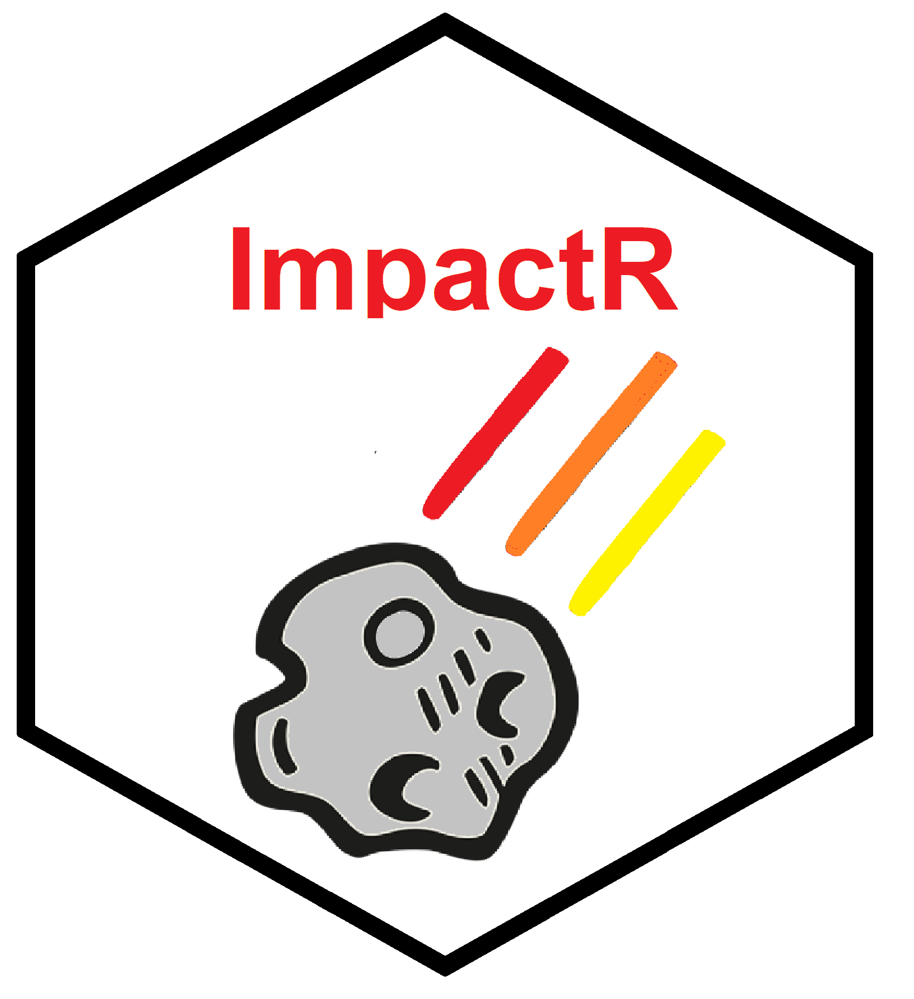

`impactR`
==========



Demonstrating the impact of research is essential for evidencing its value to stakeholders, for example public, peers, and research funding organisations. Furthermore, although traditional (citation- or journal-based) metrics of research impact remain highly regarded, the scope of research impact has now broadened to include public engagement and direct patient benefit. While individual packages are available to explore the impact of research, these have interoperability issues and so integration for further analysis can be challenging.

The `impactR` package consolidates functionality from a range of existing packages (including RISMed, rcrossref, rAltmetric, scholar) into holistic and practical quantifications of biomedical research impact. Essential publication information and research metrics (altmetric, citations, journal impact factor) can be extracted from online repositories into a single dataframe/tibble using either PubMed identification numbers (PMID) or Digital Object Identifiers (DOI). This can either be used directly for data analysis, or passed to further built-in ImpactR functions (see vignettes below).

All functions have been developed with the aim of being applicable to both individual researchers and research groups, including those utilising a collaborative research model. It is designed to be user-friendly and applicable to all publications in biomedical journals with a PMID or DOI.

These functions have a range of applications from generating publication lists to quantifying research impact by combining traditional metrics (citations, journal impact factor), with newer impact metrics such as co-authorship networks and social media presence. However, it should be emphasised this package does not encompass all measures of impact from a research output, including direct patient benefit. 

Installation and Documentation
------------------------------

You can install `impactr` from github with:

``` r
# install.packages("devtools")
devtools::install_github("kamclean/impactr")
```

It is recommended that this package is used together with `tidyverse` packages.

Vignettes
---------
[Extract and Cite Research Outputs](https://github.com/kamclean/impactr/blob/master/vignettes/vignette_1_data.md)

[Impact from Traditional Metrics](...)

[Impact from Co-authorship Network](...)

[Impact from Social Media Engagement](...)
