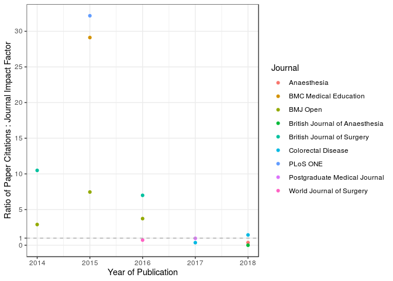

# Research Impact

Citations are a common metric for determining the impact of research on
the wider academic field. Both `extract_pmid()` and `extract_doi()` will
provide data on citations (based on PubMed/Crossref repositories) and
journal impact factor (based on [Scimago Scientific Journal
Rankings](https://www.scimagojr.com)).

## **`impact_cite()`**

The function `impact_cite()` can also produce several metrics that can
be used for the purposes of assessment of the more traditional research
impact of publications (using the
[Scholar](https://cran.r-project.org/web/packages/scholar/index.html)
package). This includes:

  - Journal-Level: Impact Factor (IF) and Eigenfactor.

  - Paper-Level: Citations (including H-Index) in both Google Scholar
    (`cite_gs`) and CrossRef / Pubmed repositories (`cite_cr` or
    `cite_pm`)

<!-- end list -->

``` r
data_cite <- impact_cite(df = data, scholar_id = "Ol5uNSwAAAAJ&hl", var_journal = "journal_edit", var_citation = "cite_pm")
```

<div style="border: 1px solid #ddd; padding: 0px; overflow-y: scroll; height:400px; overflow-x: scroll; width:1000px; ">

<table class="table table-striped" style="width: auto !important; margin-left: auto; margin-right: auto;">

<thead>

<tr>

<th style="text-align:left;position: sticky; top:0; background-color: #FFFFFF;">

doi

</th>

<th style="text-align:left;position: sticky; top:0; background-color: #FFFFFF;">

title

</th>

<th style="text-align:left;position: sticky; top:0; background-color: #FFFFFF;">

journal\_edit

</th>

<th style="text-align:right;position: sticky; top:0; background-color: #FFFFFF;">

journal\_impact

</th>

<th style="text-align:right;position: sticky; top:0; background-color: #FFFFFF;">

journal\_eigen

</th>

<th style="text-align:right;position: sticky; top:0; background-color: #FFFFFF;">

cite\_pm

</th>

<th style="text-align:right;position: sticky; top:0; background-color: #FFFFFF;">

cite\_gs

</th>

<th style="text-align:right;position: sticky; top:0; background-color: #FFFFFF;">

cite\_total

</th>

</tr>

</thead>

<tbody>

<tr>

<td style="text-align:left;">

10.1136/bmj.l795

</td>

<td style="text-align:left;">

Collaborative student research efforts provide a solution to research
wastage.

</td>

<td style="text-align:left;">

BMJ-British Medical Journal

</td>

<td style="text-align:right;">

23.259

</td>

<td style="text-align:right;">

0.15032

</td>

<td style="text-align:right;">

0

</td>

<td style="text-align:right;">

1

</td>

<td style="text-align:right;">

1

</td>

</tr>

<tr>

<td style="text-align:left;">

10.1136/bmj.l795

</td>

<td style="text-align:left;">

Collaborative student research efforts provide a solution to research
wastage.

</td>

<td style="text-align:left;">

BMJ-British Medical Journal

</td>

<td style="text-align:right;">

23.259

</td>

<td style="text-align:right;">

0.15032

</td>

<td style="text-align:right;">

0

</td>

<td style="text-align:right;">

0

</td>

<td style="text-align:right;">

0

</td>

</tr>

<tr>

<td style="text-align:left;">

10.1111/anae.14552

</td>

<td style="text-align:left;">

Peri-operative acute kidney injury - a reply.

</td>

<td style="text-align:left;">

Anaesthesia

</td>

<td style="text-align:right;">

5.431

</td>

<td style="text-align:right;">

0.00976

</td>

<td style="text-align:right;">

0

</td>

<td style="text-align:right;">

NA

</td>

<td style="text-align:right;">

0

</td>

</tr>

<tr>

<td style="text-align:left;">

s0007-0912(18)30624-x

</td>

<td style="text-align:left;">

Critical care usage after major gastrointestinal and liver surgery: a
prospective, multicentre observational study.

</td>

<td style="text-align:left;">

British Journal of Anaesthesia

</td>

<td style="text-align:right;">

6.499

</td>

<td style="text-align:right;">

0.02639

</td>

<td style="text-align:right;">

0

</td>

<td style="text-align:right;">

NA

</td>

<td style="text-align:right;">

0

</td>

</tr>

<tr>

<td style="text-align:left;">

10.1002/bjs5.86

</td>

<td style="text-align:left;">

Prognostic model to predict postoperative acute kidney injury in
patients undergoing major gastrointestinal surgery based on a national
prospective observational cohort study.

</td>

<td style="text-align:left;">

BJS open

</td>

<td style="text-align:right;">

NA

</td>

<td style="text-align:right;">

NA

</td>

<td style="text-align:right;">

0

</td>

<td style="text-align:right;">

2

</td>

<td style="text-align:right;">

2

</td>

</tr>

<tr>

<td style="text-align:left;">

10.1111/anae.14349

</td>

<td style="text-align:left;">

Association between peri-operative angiotensin-converting enzyme
inhibitors and angiotensin-2 receptor blockers and acute kidney injury
in major elective non-cardiac surgery: a multicentre, prospective cohort
study.

</td>

<td style="text-align:left;">

Anaesthesia

</td>

<td style="text-align:right;">

5.431

</td>

<td style="text-align:right;">

0.00976

</td>

<td style="text-align:right;">

0

</td>

<td style="text-align:right;">

2

</td>

<td style="text-align:right;">

2

</td>

</tr>

<tr>

<td style="text-align:left;">

10.1111/codi.14292

</td>

<td style="text-align:left;">

Body mass index and complications following major gastrointestinal
surgery: a prospective, international cohort study and meta-analysis.

</td>

<td style="text-align:left;">

Colorectal Disease

</td>

<td style="text-align:right;">

2.778

</td>

<td style="text-align:right;">

0.01319

</td>

<td style="text-align:right;">

0

</td>

<td style="text-align:right;">

4

</td>

<td style="text-align:right;">

4

</td>

</tr>

<tr>

<td style="text-align:left;">

s1743-9191(17)31498-x

</td>

<td style="text-align:left;">

Recognising contributions to work in research collaboratives: Guidelines
for standardising reporting of authorship in collaborative research.

</td>

<td style="text-align:left;">

International Journal of Surgery

</td>

<td style="text-align:right;">

2.693

</td>

<td style="text-align:right;">

0.01306

</td>

<td style="text-align:right;">

0

</td>

<td style="text-align:right;">

1

</td>

<td style="text-align:right;">

1

</td>

</tr>

<tr>

<td style="text-align:left;">

10.1111/codi.13976

</td>

<td style="text-align:left;">

Ileus Management International (IMAGINE): protocol for a multicentre,
observational study of ileus after colorectal surgery.

</td>

<td style="text-align:left;">

Colorectal Disease

</td>

<td style="text-align:right;">

2.778

</td>

<td style="text-align:right;">

0.01319

</td>

<td style="text-align:right;">

1

</td>

<td style="text-align:right;">

NA

</td>

<td style="text-align:right;">

1

</td>

</tr>

<tr>

<td style="text-align:left;">

10.1136/postgradmedj-2017-135035

</td>

<td style="text-align:left;">

Medical research and audit skills training for undergraduates: an
international analysis and student-focused needs assessment.

</td>

<td style="text-align:left;">

Postgraduate Medical Journal

</td>

<td style="text-align:right;">

2.078

</td>

<td style="text-align:right;">

0.00397

</td>

<td style="text-align:right;">

2

</td>

<td style="text-align:right;">

NA

</td>

<td style="text-align:right;">

2

</td>

</tr>

<tr>

<td style="text-align:left;">

s1743-9191(17)30119-x

</td>

<td style="text-align:left;">

Students’ participation in collaborative research should be recognised.

</td>

<td style="text-align:left;">

International Journal of Surgery

</td>

<td style="text-align:right;">

2.693

</td>

<td style="text-align:right;">

0.01306

</td>

<td style="text-align:right;">

3

</td>

<td style="text-align:right;">

11

</td>

<td style="text-align:right;">

11

</td>

</tr>

<tr>

<td style="text-align:left;">

10.1007/s00268-016-3727-3

</td>

<td style="text-align:left;">

Safety of Nonsteroidal Anti-inflammatory Drugs in Major Gastrointestinal
Surgery: A Prospective, Multicenter Cohort Study.

</td>

<td style="text-align:left;">

World Journal of Surgery

</td>

<td style="text-align:right;">

2.766

</td>

<td style="text-align:right;">

0.02402

</td>

<td style="text-align:right;">

2

</td>

<td style="text-align:right;">

NA

</td>

<td style="text-align:right;">

2

</td>

</tr>

<tr>

<td style="text-align:left;">

10.1016/s0140-6736(16)31151-5

</td>

<td style="text-align:left;">

UK surgical trainees will continue to support European research
collaboration.

</td>

<td style="text-align:left;">

The Lancet

</td>

<td style="text-align:right;">

NA

</td>

<td style="text-align:right;">

NA

</td>

<td style="text-align:right;">

0

</td>

<td style="text-align:right;">

NA

</td>

<td style="text-align:right;">

0

</td>

</tr>

<tr>

<td style="text-align:left;">

10.1002/bjs.10203

</td>

<td style="text-align:left;">

Multicentre prospective cohort study of body mass index and
postoperative complications following gastrointestinal surgery.

</td>

<td style="text-align:left;">

British Journal of Surgery

</td>

<td style="text-align:right;">

5.433

</td>

<td style="text-align:right;">

0.03122

</td>

<td style="text-align:right;">

7

</td>

<td style="text-align:right;">

38

</td>

<td style="text-align:right;">

38

</td>

</tr>

<tr>

<td style="text-align:left;">

10.1136/bmjopen-2015-009812

</td>

<td style="text-align:left;">

Outcomes After Kidney injury in Surgery (OAKS): protocol for a
multicentre, observational cohort study of acute kidney injury following
major gastrointestinal and liver surgery.

</td>

<td style="text-align:left;">

BMJ Open

</td>

<td style="text-align:right;">

2.413

</td>

<td style="text-align:right;">

0.08470

</td>

<td style="text-align:right;">

2

</td>

<td style="text-align:right;">

9

</td>

<td style="text-align:right;">

9

</td>

</tr>

<tr>

<td style="text-align:left;">

10.1136/bmjopen-2015-008811

</td>

<td style="text-align:left;">

Determining Surgical Complications in the Overweight (DISCOVER): a
multicentre observational cohort study to evaluate the role of obesity
as a risk factor for postoperative complications in general surgery.

</td>

<td style="text-align:left;">

BMJ Open

</td>

<td style="text-align:right;">

2.413

</td>

<td style="text-align:right;">

0.08470

</td>

<td style="text-align:right;">

5

</td>

<td style="text-align:right;">

18

</td>

<td style="text-align:right;">

18

</td>

</tr>

<tr>

<td style="text-align:left;">

10.1016/j.amjsurg.2015.04.005

</td>

<td style="text-align:left;">

Caution when interpreting anti-inflammatory drug effects in rat models
of gastrointestinal anastomosis.

</td>

<td style="text-align:left;">

American Journal of Surgery

</td>

<td style="text-align:right;">

2.141

</td>

<td style="text-align:right;">

0.01804

</td>

<td style="text-align:right;">

0

</td>

<td style="text-align:right;">

NA

</td>

<td style="text-align:right;">

0

</td>

</tr>

<tr>

<td style="text-align:left;">

10.1136/bmj.h2772

</td>

<td style="text-align:left;">

Training and trials–building a future.

</td>

<td style="text-align:left;">

BMJ-British Medical Journal

</td>

<td style="text-align:right;">

23.259

</td>

<td style="text-align:right;">

0.15032

</td>

<td style="text-align:right;">

1

</td>

<td style="text-align:right;">

2

</td>

<td style="text-align:right;">

2

</td>

</tr>

<tr>

<td style="text-align:left;">

10.1001/jamasurg.2015.0806

</td>

<td style="text-align:left;">

Selective vs Nonselective Nonsteroidal Anti-inflammatory Drugs and
Anastomotic Leakage After Colorectal Surgery.

</td>

<td style="text-align:left;">

JAMA Surgery

</td>

<td style="text-align:right;">

8.498

</td>

<td style="text-align:right;">

0.02494

</td>

<td style="text-align:right;">

0

</td>

<td style="text-align:right;">

NA

</td>

<td style="text-align:right;">

0

</td>

</tr>

<tr>

<td style="text-align:left;">

10.1186/s12909-015-0326-1

</td>

<td style="text-align:left;">

Promoting research and audit at medical school: evaluating the
educational impact of participation in a student-led national
collaborative study.

</td>

<td style="text-align:left;">

BMC Medical Education

</td>

<td style="text-align:right;">

1.511

</td>

<td style="text-align:right;">

0.00811

</td>

<td style="text-align:right;">

14

</td>

<td style="text-align:right;">

44

</td>

<td style="text-align:right;">

44

</td>

</tr>

<tr>

<td style="text-align:left;">

10.1371/journal.pone.0118899

</td>

<td style="text-align:left;">

Social media and internet driven study recruitment: evaluating a new
model for promoting collaborator engagement and participation.

</td>

<td style="text-align:left;">

PLoS ONE

</td>

<td style="text-align:right;">

2.766

</td>

<td style="text-align:right;">

1.86235

</td>

<td style="text-align:right;">

23

</td>

<td style="text-align:right;">

89

</td>

<td style="text-align:right;">

89

</td>

</tr>

<tr>

<td style="text-align:left;">

10.1016/s0140-6736(14)61983-8

</td>

<td style="text-align:left;">

Bridging medical education and clinical practice.

</td>

<td style="text-align:left;">

The Lancet

</td>

<td style="text-align:right;">

NA

</td>

<td style="text-align:right;">

NA

</td>

<td style="text-align:right;">

1

</td>

<td style="text-align:right;">

4

</td>

<td style="text-align:right;">

4

</td>

</tr>

<tr>

<td style="text-align:left;">

10.1002/bjs.9614

</td>

<td style="text-align:left;">

Impact of postoperative non-steroidal anti-inflammatory drugs on adverse
events after gastrointestinal surgery.

</td>

<td style="text-align:left;">

British Journal of Surgery

</td>

<td style="text-align:right;">

5.433

</td>

<td style="text-align:right;">

0.03122

</td>

<td style="text-align:right;">

11

</td>

<td style="text-align:right;">

57

</td>

<td style="text-align:right;">

57

</td>

</tr>

<tr>

<td style="text-align:left;">

10.1136/bmjopen-2014-005164

</td>

<td style="text-align:left;">

Multicentre observational cohort study of NSAIDs as risk factors for
postoperative adverse events in gastrointestinal surgery.

</td>

<td style="text-align:left;">

BMJ Open

</td>

<td style="text-align:right;">

2.413

</td>

<td style="text-align:right;">

0.08470

</td>

<td style="text-align:right;">

3

</td>

<td style="text-align:right;">

7

</td>

<td style="text-align:right;">

7

</td>

</tr>

</tbody>

</table>

</div>

 

## **Impact Metrics**

### **Citations**

Citations (e.g. `cite_total`) can be used to either provide summary
statistics or visualisations.

**Note**: Google Scholar is typically being more sensitive but less
specific in estimating citation count than Crossref / PubMed
repositories.


 

### **Journals**

As journal-level information is also extracted using `impact_cite()`
(e.g. impact factor / Eigenfactor) this can also allow some assessment
of impact of the articles in relation to the journal benchmark.

For example, the plot below demonstrates the ratio of Paper Citations :
Journal Impact Factor - any point above the horizontal line (ratio of
1:1) indicates the paper has gathered more citations than typical for
that
journal.



 

### **H-Index**

The h-index is an author-level metric that attempts to measure both the
productivity and citation impact of the publications. The index is based
on the set of the scientist’s most cited papers and the number of
citations that they have received in other publications.

`impact_cite()` will produce a h-index score automatically based on the
papers included in the dataframe supplied (using `cite_total`).
Alternatively this can be calculated directly using `score_hindex()`.

``` r
data_cite$hindex; score_hindex(data_cite$output$cite_total)
```

    ## [1] 7

    ## [1] 7

 

## **Troubleshooting**

Given the difficulty inherent in merging data from difference sources,
`impact_cite()` provides several features to proactively identify
issues:

  - **`$no_scholar`**:
    
      - If there is no corresponding google scholar record for the
        publication, then these will be listed here. The journal-level
        metrics will still be listed in `$output` (with `cite_gs` as
        NA).
    
      - The [Google Scholar
        ID](https://en.wikipedia.org/wiki/Template:Google_Scholar_id) is
        used to derive publications, and so all publications by an
        author (or authorship group) must be uploaded under one Google
        Scholar account.

 

  - **`$unmatch`**:
      - If the google scholar records were unable to be matched to the
        existing dataset (by title and year), then these will be listed
        here.
    
      - This may arise from a difference in year of publication recorded
        (due to differences in year of on-line vs print publication).
    
      - To match by title only, add the argument `match_by_year = FALSE`
        to `impact_cite()`.

 

  - **Missing Journal-Level data**:
    
      - The Scholar package uses the journal name to provide
        journal-Level data (`journal_impact` and `journal_eigen`).
    
      - This will only accept specifically formatted journal names or
        will return NA. (for example, the “British Medical Journal”
        (BMJ) must be supplied as “BMJ-British Medical Journal”).
    
      - If the journal has been incorrectly supplied or if the journal
        does not have an impact factor, then `journal_impact` and
        `journal_eigen` will be NA.
    
      - The name of the journal can be edited in the dataframe supplied
        and the column of journal names specified via `var_journal`
        (default = “journal”).
