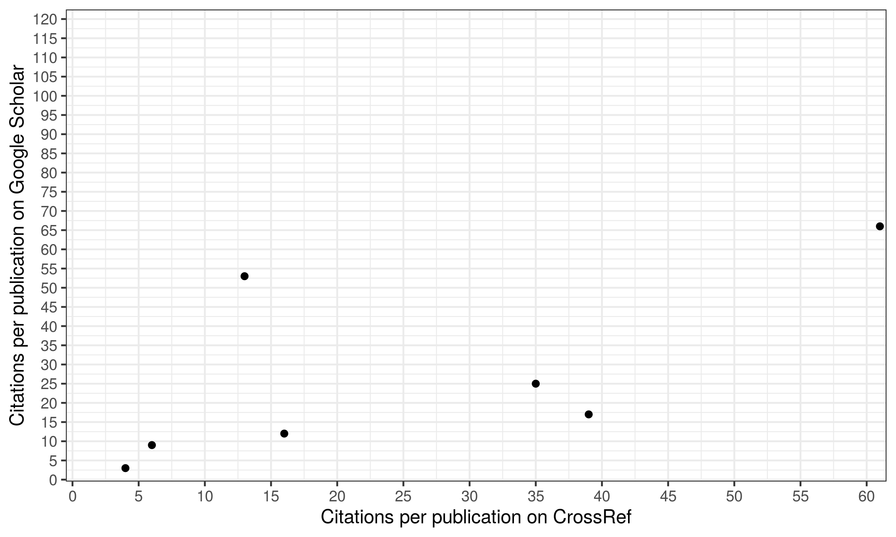
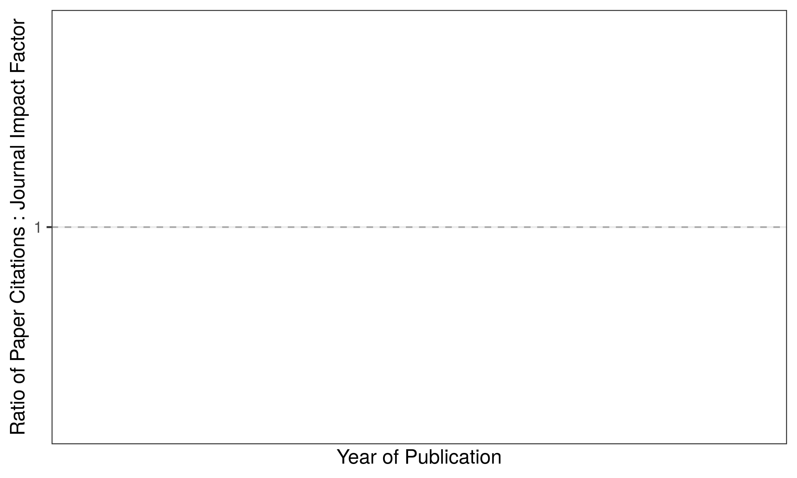

# Research Impact

Citations are a common metric for determining the impact of research on
the wider academic field. Both `extract_pmid()` and `extract_doi()` will
provide data on citations (based on PubMed/Crossref repositories) and
journal impact factor (based on [Scimago Scientific Journal
Rankings](https://www.scimagojr.com)).

## **`impact_cite()`**

The function `impact_cite()` can also produce several metrics that can
be used for the purposes of assessment of the more traditional research
impact of publications. This includes:

  - **Journal-Level**: Impact Factor (IF) and Eigenfactor.

  - **Paper-Level**: Citations from online repositories (in addition to
    PubMed):
    
      - **Google Scholar** (`cite_gs`): Accessed via the
        [gcite](https://cran.r-project.org/web/packages/gcite/index.html)
        package. (requires the Google Scholar ID for an individual to be
        supplied to `gscholar` - does not support multiple IDs).
    
      - **CrossRef** (`cite_cr`): Accessed via the
        [rcrossref](https://github.com/ropensci/rcrossref) package.
        (requires crossref=TRUE).
    
      - **Dimentions** (`cite_dim`): Accessed via the [Dimentions
        API](https://app.dimensions.ai/discover/publication) (requires
        dimentions=TRUE).
    
      - **Scopus** (`cite_scopus`): Accessed via the
        [rscopus](https://cran.r-project.org/web/packages/rscopus/index.html)
        package (requires scopus=TRUE and valid scopus API set via
        `rscopus::set_api_key()`).
    
      - **Open Citations** (`cite_oc`): Accessed via the [Open Citations
        API](https://opencitations.net/index/coci/api/v1) (requires
        oc=TRUE). Note: this is felt to be too sparcely populated at
        present (Feb 2020) to be of practical
use.

<!-- end list -->

``` r
data_cite <- impactr::impact_cite(df = data, crossref=TRUE, dimentions=TRUE, scopus=FALSE, oc = TRUE,
                     gscholar = "Ol5uNSwAAAAJ&hl", metric=TRUE)
```

<div style="border: 1px solid #ddd; padding: 0px; overflow-y: scroll; height:400px; overflow-x: scroll; width:1000px; ">

<table class="table table-striped" style="width: auto !important; margin-left: auto; margin-right: auto;">

<thead>

<tr>

<th style="text-align:left;position: sticky; top:0; background-color: #FFFFFF;">

doi

</th>

<th style="text-align:left;position: sticky; top:0; background-color: #FFFFFF;">

title

</th>

<th style="text-align:left;position: sticky; top:0; background-color: #FFFFFF;">

journal
edit

</th>

<th style="text-align:right;position: sticky; top:0; background-color: #FFFFFF;">

journal
if

</th>

<th style="text-align:right;position: sticky; top:0; background-color: #FFFFFF;">

cite
pm

</th>

<th style="text-align:right;position: sticky; top:0; background-color: #FFFFFF;">

cite gs

</th>

</tr>

</thead>

<tbody>

<tr>

<td style="text-align:left;">

10.1136/bmjopen-2014-005164

</td>

<td style="text-align:left;">

Multicentre observational cohort study of NSAIDs as risk factors for
postoperative adverse events in gastrointestinal surgery.

</td>

<td style="text-align:left;">

BMJ open

</td>

<td style="text-align:right;">

2.83

</td>

<td style="text-align:right;">

4

</td>

<td style="text-align:right;">

8

</td>

</tr>

<tr>

<td style="text-align:left;">

10.1002/bjs.9614

</td>

<td style="text-align:left;">

Impact of postoperative non-steroidal anti-inflammatory drugs on adverse
events after gastrointestinal surgery.

</td>

<td style="text-align:left;">

BJS

</td>

<td style="text-align:right;">

6.20

</td>

<td style="text-align:right;">

19

</td>

<td style="text-align:right;">

61

</td>

</tr>

<tr>

<td style="text-align:left;">

10.1136/bmjopen-2015-008811

</td>

<td style="text-align:left;">

Determining Surgical Complications in the Overweight (DISCOVER): a
multicentre observational cohort study to evaluate the role of obesity
as a risk factor for postoperative complications in general surgery.

</td>

<td style="text-align:left;">

BMJ open

</td>

<td style="text-align:right;">

2.97

</td>

<td style="text-align:right;">

8

</td>

<td style="text-align:right;">

24

</td>

</tr>

<tr>

<td style="text-align:left;">

10.1002/bjs.10203

</td>

<td style="text-align:left;">

Multicentre prospective cohort study of body mass index and
postoperative complications following gastrointestinal surgery.

</td>

<td style="text-align:left;">

BJS

</td>

<td style="text-align:right;">

5.85

</td>

<td style="text-align:right;">

8

</td>

<td style="text-align:right;">

48

</td>

</tr>

<tr>

<td style="text-align:left;">

10.1007/s00268-016-3727-3

</td>

<td style="text-align:left;">

Safety of Nonsteroidal Anti-inflammatory Drugs in Major Gastrointestinal
Surgery: A Prospective, Multicenter Cohort Study.

</td>

<td style="text-align:left;">

World journal of surgery

</td>

<td style="text-align:right;">

2.74

</td>

<td style="text-align:right;">

2

</td>

<td style="text-align:right;">

12

</td>

</tr>

<tr>

<td style="text-align:left;">

10.1111/codi.14292

</td>

<td style="text-align:left;">

Body mass index and complications following major gastrointestinal
surgery: a prospective, international cohort study and meta-analysis.

</td>

<td style="text-align:left;">

Colorectal Disease

</td>

<td style="text-align:right;">

2.93

</td>

<td style="text-align:right;">

2

</td>

<td style="text-align:right;">

11

</td>

</tr>

<tr>

<td style="text-align:left;">

s0007-0912(18)30624-x

</td>

<td style="text-align:left;">

Critical care usage after major gastrointestinal and liver surgery: a
prospective, multicentre observational study.

</td>

<td style="text-align:left;">

British journal of anaesthesia

</td>

<td style="text-align:right;">

5.15

</td>

<td style="text-align:right;">

0

</td>

<td style="text-align:right;">

1

</td>

</tr>

<tr>

<td style="text-align:left;">

10.1136/bmjopen-2015-009812

</td>

<td style="text-align:left;">

Outcomes After Kidney injury in Surgery (OAKS): protocol for a
multicentre, observational cohort study of acute kidney injury following
major gastrointestinal and liver surgery.

</td>

<td style="text-align:left;">

BMJ open

</td>

<td style="text-align:right;">

2.57

</td>

<td style="text-align:right;">

8

</td>

<td style="text-align:right;">

15

</td>

</tr>

<tr>

<td style="text-align:left;">

10.1002/bjs5.86

</td>

<td style="text-align:left;">

Prognostic model to predict postoperative acute kidney injury in
patients undergoing major gastrointestinal surgery based on a national
prospective observational cohort study.

</td>

<td style="text-align:left;">

BJS open

</td>

<td style="text-align:right;">

5.01

</td>

<td style="text-align:right;">

2

</td>

<td style="text-align:right;">

6

</td>

</tr>

<tr>

<td style="text-align:left;">

10.1111/anae.14349

</td>

<td style="text-align:left;">

Association between peri-operative angiotensin-converting enzyme
inhibitors and angiotensin-2 receptor blockers and acute kidney injury
in major elective non-cardiac surgery: a multicentre, prospective cohort
study.

</td>

<td style="text-align:left;">

Anaesthesia

</td>

<td style="text-align:right;">

5.01

</td>

<td style="text-align:right;">

1

</td>

<td style="text-align:right;">

8

</td>

</tr>

<tr>

<td style="text-align:left;">

10.1111/anae.14552

</td>

<td style="text-align:left;">

Peri-operative acute kidney injury - a reply.

</td>

<td style="text-align:left;">

Anaesthesia

</td>

<td style="text-align:right;">

5.01

</td>

<td style="text-align:right;">

0

</td>

<td style="text-align:right;">

0

</td>

</tr>

<tr>

<td style="text-align:left;">

10.1111/codi.13976

</td>

<td style="text-align:left;">

Ileus Management International (IMAGINE): protocol for a multicentre,
observational study of ileus after colorectal surgery.

</td>

<td style="text-align:left;">

Colorectal Disease

</td>

<td style="text-align:right;">

2.73

</td>

<td style="text-align:right;">

2

</td>

<td style="text-align:right;">

16

</td>

</tr>

<tr>

<td style="text-align:left;">

10.1002/bjs.11326

</td>

<td style="text-align:left;">

Safety and efficacy of non-steroidal anti-inflammatory drugs to reduce
ileus after colorectal surgery.

</td>

<td style="text-align:left;">

BJS

</td>

<td style="text-align:right;">

5.02

</td>

<td style="text-align:right;">

0

</td>

<td style="text-align:right;">

2

</td>

</tr>

<tr>

<td style="text-align:left;">

10.1371/journal.pone.0118899

</td>

<td style="text-align:left;">

Social media and internet driven study recruitment: evaluating a new
model for promoting collaborator engagement and participation.

</td>

<td style="text-align:left;">

PloS one

</td>

<td style="text-align:right;">

3.45

</td>

<td style="text-align:right;">

30

</td>

<td style="text-align:right;">

109

</td>

</tr>

<tr>

<td style="text-align:left;">

10.1186/s12909-015-0326-1

</td>

<td style="text-align:left;">

Promoting research and audit at medical school: evaluating the
educational impact of participation in a student-led national
collaborative study.

</td>

<td style="text-align:left;">

BMC medical education

</td>

<td style="text-align:right;">

1.76

</td>

<td style="text-align:right;">

20

</td>

<td style="text-align:right;">

50

</td>

</tr>

<tr>

<td style="text-align:left;">

10.1136/postgradmedj-2017-135035

</td>

<td style="text-align:left;">

Medical research and audit skills training for undergraduates: an
international analysis and student-focused needs assessment.

</td>

<td style="text-align:left;">

Postgraduate medical journal

</td>

<td style="text-align:right;">

1.85

</td>

<td style="text-align:right;">

3

</td>

<td style="text-align:right;">

6

</td>

</tr>

<tr>

<td style="text-align:left;">

s1743-9191(17)30119-x

</td>

<td style="text-align:left;">

Students’ participation in collaborative research should be recognised.

</td>

<td style="text-align:left;">

International journal of surgery (London, England)

</td>

<td style="text-align:right;">

2.79

</td>

<td style="text-align:right;">

3

</td>

<td style="text-align:right;">

14

</td>

</tr>

<tr>

<td style="text-align:left;">

s1743-9191(17)31498-x

</td>

<td style="text-align:left;">

Recognising contributions to work in research collaboratives: Guidelines
for standardising reporting of authorship in collaborative research.

</td>

<td style="text-align:left;">

International journal of surgery (London, England)

</td>

<td style="text-align:right;">

3.15

</td>

<td style="text-align:right;">

3

</td>

<td style="text-align:right;">

3

</td>

</tr>

<tr>

<td style="text-align:left;">

10.1016/s0140-6736(14)61983-8

</td>

<td style="text-align:left;">

Bridging medical education and clinical practice.

</td>

<td style="text-align:left;">

Lancet (London, England)

</td>

<td style="text-align:right;">

34.82

</td>

<td style="text-align:right;">

2

</td>

<td style="text-align:right;">

4

</td>

</tr>

<tr>

<td style="text-align:left;">

10.1001/jamasurg.2015.0806

</td>

<td style="text-align:left;">

Selective vs Nonselective Nonsteroidal Anti-inflammatory Drugs and
Anastomotic Leakage After Colorectal Surgery.

</td>

<td style="text-align:left;">

JAMA surgery

</td>

<td style="text-align:right;">

5.59

</td>

<td style="text-align:right;">

0

</td>

<td style="text-align:right;">

NA

</td>

</tr>

<tr>

<td style="text-align:left;">

10.1136/bmj.h2772

</td>

<td style="text-align:left;">

Training and trials–building a future.

</td>

<td style="text-align:left;">

BMJ (Clinical research ed.)

</td>

<td style="text-align:right;">

6.32

</td>

<td style="text-align:right;">

1

</td>

<td style="text-align:right;">

2

</td>

</tr>

<tr>

<td style="text-align:left;">

10.1016/j.amjsurg.2015.04.005

</td>

<td style="text-align:left;">

Caution when interpreting anti-inflammatory drug effects in rat models
of gastrointestinal anastomosis.

</td>

<td style="text-align:left;">

American journal of surgery

</td>

<td style="text-align:right;">

2.66

</td>

<td style="text-align:right;">

0

</td>

<td style="text-align:right;">

0

</td>

</tr>

<tr>

<td style="text-align:left;">

10.1016/s0140-6736(16)31151-5

</td>

<td style="text-align:left;">

UK surgical trainees will continue to support European research
collaboration.

</td>

<td style="text-align:left;">

Lancet (London, England)

</td>

<td style="text-align:right;">

28.66

</td>

<td style="text-align:right;">

0

</td>

<td style="text-align:right;">

NA

</td>

</tr>

<tr>

<td style="text-align:left;">

10.1136/bmj.l795

</td>

<td style="text-align:left;">

Collaborative student research efforts provide a solution to research
wastage.

</td>

<td style="text-align:left;">

BMJ (Clinical research ed.)

</td>

<td style="text-align:right;">

5.48

</td>

<td style="text-align:right;">

1

</td>

<td style="text-align:right;">

5

</td>

</tr>

</tbody>

</table>

</div>

 

## **Impact Metrics**

### **Citations**

Citations (e.g. `cite_max`) can be used to either provide summary
statistics or visualisations.

**Note**: Google Scholar is typically being more sensitive but less
specific in estimating citation count than Crossref / PubMed
repositories.



Only Google Scholar and [Open Citations](https://opencitations.net/)
allow exporation of the citations over time. This will be included in
the output of `impact_cite()` if either of those sources are selected.

This can be used to plot the longitudinal impact of the paper through
citations over time.


 

### **Journals**

As journal-level information is also extracted using `impact_cite()`
(e.g. impact factor / Eigenfactor) this can also allow some assessment
of impact of the articles in relation to the journal benchmark.

For example, the plot below demonstrates the ratio of Paper Citations :
Journal Impact Factor - any point above the horizontal line (ratio of
1:1) indicates the paper has gathered more citations than typical for
that journal.

  

### **Metrics**

Citation metrics are author-level measures that attempts to assess both
the productivity and citation impact of the publications. These include:

  - **Total citations**: Total number of citations that they have
    received in other publications.

  - **[H-Index](https://harzing.com/popbook/ch1_4_2.htm)**: Based on the
    set of the scientist’s most cited papers and the number of citations
    that they have received in other publications.

  - **[M-Quotient](https://harzing.com/popbook/ch1_4_3.htm)**: A method
    to facilitate comparisons between academics with different lengths
    of academic careers. This divides the h-index by the number of years
    the academic has been active (measured as the number of years since
    the first published paper)

  - **[G-Index](https://harzing.com/popbook/ch1_4_6.htm)**: It aims to
    improve on the h-index by giving more weight to highly-cited
    articles. The H-Index can “undervalue” highly cited papers as it
    ignores the number of citations to each individual article beyond
    what is needed to achieve a certain h-index.

`impact_cite()` will produce common citation metrics automatically based
on the papers included in the dataframe supplied. Alternatively this can
be calculated directly using
`impact_cite_metric()`.

``` r
data_cite$metric; impactr::impact_cite_metric(data_cite$df$cite_max, data_cite$df$year)
```

    ## # A tibble: 1 x 4
    ##   total_cite hindex gindex mquotient
    ##        <dbl>  <int>  <int>     <dbl>
    ## 1        409     10     20   0.00495

    ## # A tibble: 1 x 4
    ##   total_cite hindex gindex mquotient
    ##        <dbl>  <int>  <int>     <dbl>
    ## 1        409     10     20   0.00495

 

## **Troubleshooting (`$validation`) **

The [Google Scholar
ID](https://en.wikipedia.org/wiki/Template:Google_Scholar_id) is used to
derive publications, and so all publications by an author (or authorship
group) must be uploaded under one Google Scholar account.

As google scholar does not contain DOI or PMID, papers must be matched
by title, and can only be matched if there is a google scholar record
for each paper in the supplied dataframe. `impact_cite()` provides
several features to proactively identify issues via `$validation`
output.

The outcome will record either `matched`, or the following:

  - **`noscholar`**: If there is no corresponding google scholar record
    for the publication, then these will be listed here.

  - **`unmatch`**: If the google scholar records were unable to be
    matched to the existing dataset (by title), then these will be
    listed here.
