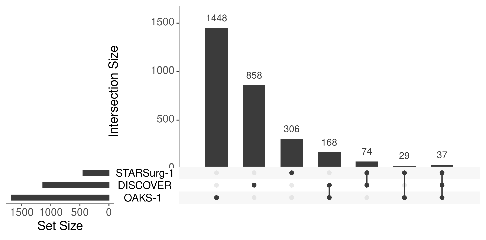
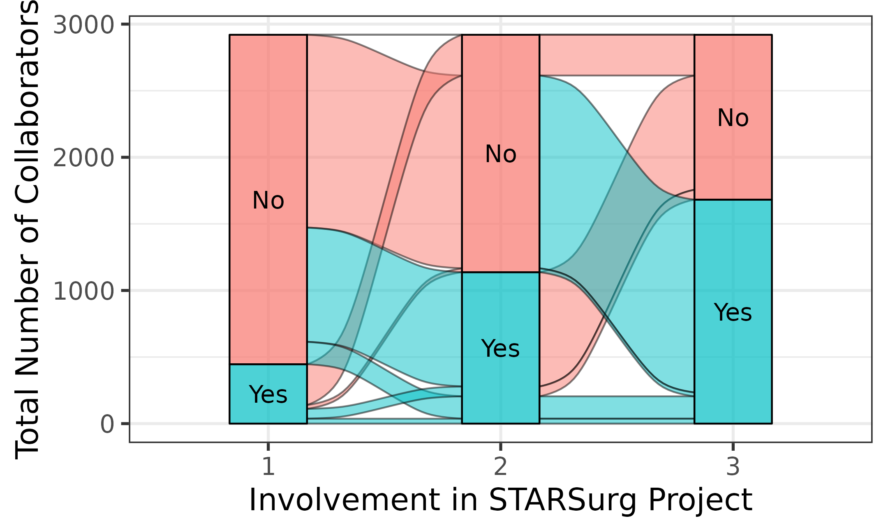

```{r setup, include = FALSE}
knitr::opts_chunk$set(collapse = FALSE)
library(tidyverse);library(magrittr)
library(UpSetR);library(grid);library(ComplexHeatmap);library(ggalluvial)
```

# **Impact from from Co-authorship Network**
Authorship lists on publications can range from one to potentially hundreds or even thousands of co-authors (particularly in the case of [collaborative research](https://www.bmj.com/content/345/bmj.e5084) studies).

## **impact_auth()**
The `impact_auth()` function aims to simplify this process by providing an easy method to gain a comprehensive understanding of co-authorship networks using publication data.

Both the `extract_pmid()` and `extract_doi()` functions extract a list of authors that can be used directly by `impact_auth()`. The only mandatory requirements are a dataframe of the grouping variable (`pub_group` e.g. "project") and the authors ("author").

To track co-authors across publications, the author names must be matched between the groups (and dupliciates within groups excluded). Ideally authors would be matched on ORCID (or similar unique identifier). Unfortunalely, that information is rarely stored in on-line repositories and so authors dervied in this way can only be reliably matched by last name and initials. However, `max_inital` allows flexiblity in how restrictive matching authors will be.

 - If `max_inital` = 3, then the authors will be matched on their last name and exact initials (up to 3). As a result, this **more** restrictive matching may overestimate the number of unique co-authors. For example, if the **same author** is listed as "Smith ABC" and "Smith AB" on 2 separate publications, these will be treated as **different authors**.

 - If `max_inital` = 1, then the authors will be matched on their last name and first initial only. As a result, this **less** restrictive matching may underestimate the number of unique co-authors. For example, if **different authors** have the same last name and first initial (e.g. listed as "Smith AB" and "Smith AK") on 2 separate publications, these will be treated as the **same author**.
 

## 1. Traditional Authorship Model
```{r impact_auth_intro1a, warning=FALSE, message=FALSE}
data_auth <- impactr::extract_pmid(pmid = c(26445672, 28280919, 27531411, 28027614,
                                              30850367, 31585971, 30793373), get_auth = TRUE) %>%
  dplyr::mutate(project = factor(pmid)) %>%
  dplyr::select(project, author)
```
```{r impact_auth_intro1b, warning=FALSE, message=FALSE, echo=FALSE}
data_auth %>%
  dplyr::mutate(author = paste0(substr(author, 1, 80), "...")) %>%
  knitr::kable() %>% kableExtra::kable_styling(bootstrap_options = "striped", full_width = F)
```

```{r impact_auth_intro1c, warning=FALSE, message=FALSE}
example_auth <- impactr::impact_auth(data_auth, pub_group = "project", max_inital = 1, upset = TRUE, metric = FALSE)
```

### a). List
```{r impact_list, warning=FALSE, message=FALSE, echo=FALSE}
example_auth$list %>%
  knitr::kable() %>% kableExtra::kable_styling(bootstrap_options = "striped", full_width = F)
```

### b). List
```{r impact_list, warning=FALSE, message=FALSE, echo=FALSE}
example_auth$upset %>%
  knitr::kable() %>% kableExtra::kable_styling(bootstrap_options = "striped", full_width = F)
```


## 2. Collaborative Authorship Model

Since the first inception of the [collaborative research model](https://www.bmj.com/content/345/bmj.e5084) in 2010, there has arisen numerous research collaboratives which have run multiple projects with resultant publications. Those involved who gain pubmed-citable authorship on the publications arising from data collected. In addition to more traditional research metrics, a measure of the success of these projects is reflected in:

  1. The number of new collaborators involved in each project (aka growth). 

  2. The involvement of collaborators across multiple projects (aka retention).
  
  3. The total number of collaborators involved in the project (overall engagement e.g. growth + retention).
  
However, with potentially thousands of collaborators involved, being able to easily compare authors across multiple publications is a challenging task.

&nbsp;


```{r impact_auth_intro1, warning=FALSE, message=FALSE}
data_collab <- impactr::extract_pmid(pmid = c(25091299, 27321766, 30513129), get_auth = TRUE) %>%
  dplyr::mutate(project = factor(pmid,
                                 levels = c(25091299, 27321766, 30513129),
                                 labels =c("STARSurg-1", "DISCOVER", "OAKS-1"))) %>%
  dplyr::select(project, author)
```

```{r impact_auth_intro2, warning=FALSE, message=FALSE, echo=FALSE}
data_collab %>%
  dplyr::mutate(author = paste0(substr(author, 1, 80), "...")) %>%
  knitr::kable() %>% kableExtra::kable_styling(bootstrap_options = "striped", full_width = F)
```

```{r impact_auth_intro, warning=FALSE, message=FALSE}
example <- impactr::impact_auth(data, pub_group = "project", max_inital = 1, upset = TRUE, metric = TRUE)
```

&nbsp;

## **Output**
There are 3 potential outputs from `impact_auth()` as nested dataframes: `$list`, `$upset`, and `$metrics`.

### **1. $list**
This will provide a basic summary of all unique collaborators across all groups (`author`), and their involvement in each (`pub_n`, `pub_group`). 

```{r impact_list, warning=FALSE, message=FALSE, echo=FALSE}
example$list %>%
  dplyr::slice(., sample(1:nrow(.),5,replace=F)) %>%
  knitr::kable() %>% kableExtra::kable_styling(bootstrap_options = "striped", full_width = F)
```

This data can be used in a variety of ways, including a basic summary of involvement over time. For example, the number of projects authors/collaborators have been involved in:

```{r impact_auth_ss1, warning=FALSE, message=FALSE}
example$list %>%
  finalfit::summary_factorlist(explanatory = "pub_n", column = TRUE) %>%
  tibble::as_tibble() %>% knitr::kable() %>% kableExtra::kable_styling(bootstrap_options = "striped", full_width = F)
```

&nbsp;

### **2. $upset**
The `impact_auth()` function has the capability to derive information on how the authors relate using the `upset = TRUE` arguement (default).

A subset of the `upset` output is displayed below. Each column is a level from the `pub_group` variable (e.g. "project"), with `0` representing presence and the `1` representing absence of the author from each project.

```{r impact_auth_upset1b, warning=FALSE, message=FALSE, echo=FALSE}
example$upset %>%
  dplyr::slice(., sample(1:nrow(.),5,replace=F)) %>%
  knitr::kable() %>% kableExtra::kable_styling(bootstrap_options = "striped", full_width = F)
```

This data can be used in multiple ways, for example:

#### a). Descriptive summaries:
The `upset` output can be used by the [ComplexHeatmap](https://github.com/jokergoo/ComplexHeatmap) package to derive information on the relationships between authors and the groups (`pub_group` variable).

```{r impact_auth_upset2, warning=FALSE, message=FALSE,}
upset_comb_mat <- ComplexHeatmap::make_comb_mat(example$upset)

impactr::comb_name_size(upset_comb_mat) %>% knitr::kable() %>% kableExtra::kable_styling(bootstrap_options = "striped", full_width = F)
```

&nbsp;

#### b). UpSet plots / Venn diagrams 
UpSet plots provide an efficient way to visualize intersections of multiple sets compared to the traditional approaches (e.g. Venn Diagram). The `upset` output can be used directly to make UpSet plots by the [ComplexHeatmap](https://github.com/jokergoo/ComplexHeatmap) and [UpSetR](https://github.com/hms-dbmi/UpSetR) packages.

```{r impact_auth_upset3ai, echo=TRUE, results='hide'}
example$upset %>%
  ComplexHeatmap::make_comb_mat() %>%
  ComplexHeatmap::UpSet(m = ., set_order = c("STARSurg-1", "DISCOVER", "OAKS-1"))
```
```{r impact_auth_upset3aii, echo=FALSE}
plot_upset1 <- example$upset %>%
  ComplexHeatmap::make_comb_mat() %>%
  
  ComplexHeatmap::UpSet(m = ., set_order = c("STARSurg-1", "DISCOVER", "OAKS-1"))
ggsave(plot = grid::grid.draw(grid::grid.grabExpr(ComplexHeatmap::draw(plot_upset1))),
       filename="~/impactr/vignettes/plot/plot_upset1.png",height=3.76, width = 7.60, units ="in")
```


```{r impact_auth_upset3bi, echo=TRUE, results='hide'}
as.data.frame(example$upset) %>%
  UpSetR::upset(text.scale = 1.7)
```

```{r impact_auth_upset3bii, echo=FALSE, message=FALSE, error=FALSE,include=FALSE, warning = FALSE}
plot_upset2 <- example$upset %>% as.data.frame() %>%
  UpSetR::upset(text.scale = 1.7)

png(file="~/impactr/vignettes/plot/plot_upset2.png", height = 3.76, width = 7.60, units = "in", res=300)
plot_upset2
dev.off()
```


&nbsp;

#### c). Alluvial diagrams:
Alternatively, it can be used for Alluvial diagrams to provide a visualisation of author/collaborator involvement over time (variations of [Sankey diagrams](https://datavizcatalogue.com/methods/sankey_diagram.html)).

```{r impact_auth_alluvial, warning=FALSE, message=FALSE, echo = FALSE}
plot_alluvial <-  example$upset %>%
  # format data
  mutate_all(function(x){factor(x, levels = c(0, 1), labels = c("No", "Yes"))}) %>%
  table() %>% tibble::as_tibble() %>%
  ggforce::gather_set_data(., x = 1:(which(colnames(.)=="n")-1), id="alluvium") %>%
  dplyr::mutate(project = factor(x, levels = unique(x)),
                strata = factor(y, levels = unique(y))) %>%
  
  # select only essential columns
  dplyr::select(project, strata, n, alluvium) %>%
  
  # plot data
  ggplot() +
  aes(x = project, y = n, alluvium = alluvium, stratum = strata, fill = strata, label = strata) +
  ggalluvial::geom_flow(stat = "alluvium", lode.guidance = "rightleft", aes.flow = "backward", color = "black") +
  ggalluvial::geom_stratum(alpha = 0.7) +
  geom_text(stat = "stratum", size = 5) +
  scale_x_discrete(name = "Involvement in STARSurg Project") +
  scale_y_continuous(name = "Total Number of Collaborators") +
  theme_bw(base_size = 18) + guides(fill=FALSE)
  
ggsave(plot_alluvial, filename = "~/impactr/vignettes/plot/plot_alluvial.png",
       height = 5.76*0.75, width = 9.60*0.75)
```



&nbsp;

### **3. $metric**
Finally `impact_auth()` can provide metrics on author/collaborator engagement over time (note this requires `upset=TRUE`). 

```{r impact_auth_metric, warning=FALSE, message=FALSE}
knitr::kable(example$metric)%>% 
  kableExtra::kable_styling(bootstrap_options = "striped", full_width = F) %>% 
  kableExtra::scroll_box(width = "1000")
```

 a). `total_change_prop` and `new_change_prop` refers to the number of collaborators (in total or new) involved in each project compared to the previous project.

 - A value of **1** indicates **consistant** engagement **compared with previous years** (stable growth).
    
 - A value **>1** indicates an **increase** in engagement **compared with previous years** (accelerated growth).
    
 b). `retain_prop` refers to the proportion of collaborators from each project involved in future projects (e.g. `n_retain` / `n_total`). This value can range from 0 (0%) to 1 (100%).
 
&nbsp;
