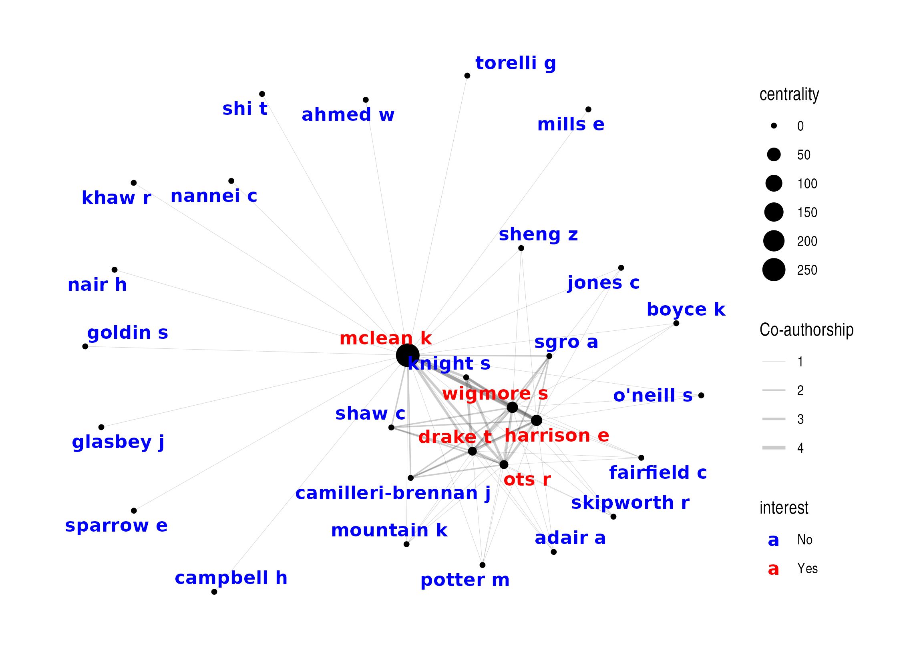

# **Impact from from Co-authorship Network**

Authorship lists on publications can range from one to potentially
hundreds or even thousands of co-authors (particularly in the case of
[collaborative research](https://www.bmj.com/content/345/bmj.e5084)
studies).

 

## **impact\_auth()**

The `impact_auth()` function aims to simplify this process by providing
an easy method to gain a comprehensive understanding of co-authorship
networks using publication data.

Both the `extract_pmid()` and `extract_doi()` functions extract a list
of authors that can be used directly by `impact_auth()`. The only
mandatory requirements are a dataframe of the grouping variable
(`pub_group` e.g. “project”) and the authors (“author”).

To track co-authors across publications, the author names must be
matched between the groups (and dupliciates within groups excluded).
Ideally authors would be matched on ORCID (or similar unique
identifier). Unfortunalely, that information is rarely stored in on-line
repositories and so authors dervied in this way can only be reliably
matched by last name and initials. However, `max_inital` allows
flexiblity in how restrictive matching authors will be.

  - If `max_inital` = 3, then the authors will be matched on their last
    name and exact initials (up to 3). As a result, this **more**
    restrictive matching may overestimate the number of unique
    co-authors. For example, if the **same author** is listed as “Smith
    ABC” and “Smith AB” on 2 separate publications, these will be
    treated as **different authors**.

  - If `max_inital` = 1, then the authors will be matched on their last
    name and first initial only. As a result, this **less** restrictive
    matching may underestimate the number of unique co-authors. For
    example, if **different authors** have the same last name and first
    initial (e.g. listed as “Smith AB” and “Smith AK”) on 2 separate
    publications, these will be treated as the **same author**.

 

## **1. Traditional Authorship Model**

Traditional authorship models, largely based on the criteria of the
International Committee of Medical Journal Editors (ICMJE), consider the
authors’ byline in the papers as the key for attributing credit.
Securing a place in the byline is itself a credit, whilst taking the
first place is often the reward for contributing the most to the
multi-authored work. While this model has been criticised (particularly
given this definition of authorship only covers a very limited series of
relationships that a person can have with a published article), this
remains the mainstay of scientific publication ( [read more
here](https://www.ncbi.nlm.nih.gov/pmc/articles/PMC3677992/) ).

An example of several papers published using a traditional authorship
model can be seen
here:

``` r
data_auth <- impactr::extract_pmid(pmid = c(26445672, 28280919, 27531411, 28027614,
                                            30850367, 31585971, 30793373), get_auth = TRUE) %>%
  dplyr::mutate(pmid = factor(pmid)) %>%
  dplyr::mutate(author_n = stringr::str_count(author, ", ")+1) %>%
  dplyr::select(pmid, author_n, author)
```

| pmid     | author\_n | author                                                                            |
| :------- | --------: | :-------------------------------------------------------------------------------- |
| 26445672 |         4 | Shi T, McLean K, Campbell H, Nair H…                                              |
| 28280919 |         7 | McLean KA, Sheng Z, O’Neill S, Boyce K, Jones C, Wigmore SJ, Harrison EM…         |
| 27531411 |         5 | McLean KA, Goldin S, Nannei C, Sparrow E, Torelli G…                              |
| 28027614 |         8 | McLean KA, Camilleri-Brennan J, Knight SR, Drake TM, Ots R, Shaw CA, Wigmore SJ,… |
| 30850367 |         5 | Ahmed WU, Mills E, Khaw RA, McLean KA, Glasbey JC…                                |
| 31585971 |        12 | McLean KA, Mountain KE, Shaw CA, Drake TM, Ots R, Knight SR, Fairfield CJ, Sgrò … |
| 30793373 |         9 | McLean KA, Drake TM, Sgrò A, Camilleri-Brennan J, Knight SR, Ots R, Adair A, Wig… |

``` r
example_auth <- impactr::impact_auth(data_auth, pub_group = "pmid", max_inital = 1)
```

 

### **a). Unique authors (`$list`)**

We can use `impact_auth()` to derive a basic summary (`$list`) of all
unique collaborators across all groups (`author`), and their involvement
in each (`pub_n`,
`pub_group`).

``` r
example_auth$list
```

<table class="table table-striped" style="width: auto !important; margin-left: auto; margin-right: auto;">

<thead>

<tr>

<th style="text-align:left;">

author

</th>

<th style="text-align:right;">

pub\_n

</th>

<th style="text-align:left;">

pub\_group

</th>

</tr>

</thead>

<tbody>

<tr>

<td style="text-align:left;">

shi t

</td>

<td style="text-align:right;">

1

</td>

<td style="text-align:left;">

26445672

</td>

</tr>

<tr>

<td style="text-align:left;">

o’neill s

</td>

<td style="text-align:right;">

1

</td>

<td style="text-align:left;">

28280919

</td>

</tr>

<tr>

<td style="text-align:left;">

adair a

</td>

<td style="text-align:right;">

1

</td>

<td style="text-align:left;">

30793373

</td>

</tr>

<tr>

<td style="text-align:left;">

shaw c

</td>

<td style="text-align:right;">

2

</td>

<td style="text-align:left;">

28027614, 31585971

</td>

</tr>

<tr>

<td style="text-align:left;">

goldin s

</td>

<td style="text-align:right;">

1

</td>

<td style="text-align:left;">

27531411

</td>

</tr>

</tbody>

</table>

 

### **b). Network analysis (`impact_auth_network()`)**

Scientific collaboration networks are a hallmark of contemporary
academic research. Researchers are no longer independent players, but
members of teams that bring together complementary skills and
multidisciplinary approaches around common goals. Social network
analysis and co-authorship networks are increasingly used as powerful
tools to assess collaboration trends and to identify leading scientists
and organizations ( [read more
here](https://health-policy-systems.biomedcentral.com/articles/10.1186/s12961-016-0104-5)
). R provides many capabilities to visualise network analyses, however
all require inputs with specific formats in order to perform these.

**`impact_auth_network()`** takes a dataframe produced by
`extract_pmid()` or `extract_doi()` (or any dataframe which matches the
format of the `pmid` or `doi`, and `auth_list` columns) and will produce
a nested list of:

1.  **$node**: All individual authors.

2.  **$edge**: All connections between authors (and their weight).

This can then be plotted using packages such as `igraph`, `tidygraph`,
`networkD3`, etc.

``` r
plot_network1 <- impactr::impact_auth_network(data_auth) %$%
  
  tidygraph::tbl_graph(nodes = node, edges = edge, directed = FALSE) %>%
  dplyr::mutate(centrality = tidygraph::centrality_betweenness()) %>% 
  
  ggraph::ggraph(layout = "nicely") +
  ggraph::geom_edge_link(aes(width = weight), alpha = 0.5) + 
  ggraph::scale_edge_width(range = c(0.1, 1)) +
  ggraph::geom_node_point(aes(size = centrality)) +
  ggraph::geom_node_text(aes(label = author),colour="red", fontface="bold", repel = TRUE) +
  ggplot2::scale_color_manual(values = c("Yes" = "red", "No" = "#ADD8E6")) +
  ggplot2::labs(edge_width = "Co-authorship") +
  ggraph::theme_graph()
```


 

If there are specific authors of interest, these can be supplied via
`auth_interest`. This will ensure only direct connections to the
specified author(s) will be included.

``` r
plot_network2 <- impactr::impact_auth_network(data_auth,
                                              auth_interest = c("mclean k", "drake t", "harrison e", "ots r", "wigmore s")) %$%

tidygraph::tbl_graph(nodes = node, edges = edge, directed = FALSE) %>%
  dplyr::mutate(centrality = tidygraph::centrality_betweenness()) %>% 
  
  ggraph::ggraph(layout = "nicely") +
  ggraph::geom_edge_link(aes(width = weight), alpha = 0.5) + 
  ggraph::scale_edge_width(range = c(0.1, 1)) +
  ggraph::geom_node_point(aes(size = centrality)) +
  ggraph::geom_node_text(aes(label = author, group = interest, colour = interest), fontface="bold", repel = TRUE) +
  ggplot2::scale_color_manual(values = c("Yes" = "red", "No" = "blue")) +
  ggplot2::labs(edge_width = "Co-authorship") +
  ggraph::theme_graph()
```



**Note**: *Publications with a hundreds or thousands of authors
(e.g. collaborative authorship model publications) are generally
unsuitable for this form of network analysis. It is recommended that
UpSet plots are used instead to investigate these publications (see
below). However, if the publications under investigation consist of
traditional and collaborative authorships, this can be done (however
`edge_min` should be set to 2 or more to account for the high number of
single connections within publications).*

 

## **2. Collaborative Authorship Model**

Collaborative research is becoming increasingly common, recognising the
valuable contribution that people beyond traditionally recognised
“authors” make. Typically, those involved are listed as PubMed-citable
“collaborators” on the publications due to contibuting eligible data.
The number of “collaborators” can range from hundreds to thousands.

An example of several publications by the [STARSurg
collaborative](https://starsurg.org/) using a collaborative authorship
model can be seen below. This composes 3 successive studies from the
group (STARSurg-1, DISCOVER, and
OAKS-1)

``` r
data_collab <- impactr::extract_pmid(pmid = c(25091299, 27321766, 30513129), get_auth = TRUE) %>%
  dplyr::mutate(project = factor(pmid,
                                 levels = c(25091299, 27321766, 30513129),
                                 labels =c("STARSurg-1", "DISCOVER", "OAKS-1"))) %>%
  dplyr::mutate(author_n = stringr::str_count(author, ", ")+1) %>%
  dplyr::select(project, pmid, author_n, author)
```

<table class="table table-striped" style="width: auto !important; margin-left: auto; margin-right: auto;">

<thead>

<tr>

<th style="text-align:left;">

project

</th>

<th style="text-align:left;">

pmid

</th>

<th style="text-align:right;">

author\_n

</th>

<th style="text-align:left;">

author

</th>

</tr>

</thead>

<tbody>

<tr>

<td style="text-align:left;">

STARSurg-1

</td>

<td style="text-align:left;">

25091299

</td>

<td style="text-align:right;">

476

</td>

<td style="text-align:left;">

Chapman SJ, Glasbey J, Kelly M, Khatri C, Nepogodiev D, Fitzgerald JE,
Bhangu A,…

</td>

</tr>

<tr>

<td style="text-align:left;">

DISCOVER

</td>

<td style="text-align:left;">

27321766

</td>

<td style="text-align:right;">

1215

</td>

<td style="text-align:left;">

Drake TM, Nepogodiev D, Chapman SJ, Glasbey JC, Khatri C, Kong CY,
Claireaux HA,…

</td>

</tr>

<tr>

<td style="text-align:left;">

OAKS-1

</td>

<td style="text-align:left;">

30513129

</td>

<td style="text-align:right;">

1784

</td>

<td style="text-align:left;">

Nepogodiev D, Walker K, Glasbey JC, Drake TM, Borakati A, Kamarajah S,
McLean
K,…

</td>

</tr>

</tbody>

</table>

``` r
example_collab <- impactr::impact_auth(data_collab, pub_group = "project", max_inital = 1, upset = TRUE, metric = TRUE)
```

 

### **a). Unique authors (`$list`)**

We can use `impact_auth()` to derive a basic summary (`$list`) of all
unique collaborators across all groups (`author`), and their involvement
in each (`pub_n`,
`pub_group`).

``` r
example_collab$list
```

<table class="table table-striped" style="width: auto !important; margin-left: auto; margin-right: auto;">

<thead>

<tr>

<th style="text-align:left;">

author

</th>

<th style="text-align:right;">

pub\_n

</th>

<th style="text-align:left;">

pub\_group

</th>

</tr>

</thead>

<tbody>

<tr>

<td style="text-align:left;">

kerr a

</td>

<td style="text-align:right;">

1

</td>

<td style="text-align:left;">

DISCOVER

</td>

</tr>

<tr>

<td style="text-align:left;">

choi j

</td>

<td style="text-align:right;">

1

</td>

<td style="text-align:left;">

OAKS-1

</td>

</tr>

<tr>

<td style="text-align:left;">

thorn c

</td>

<td style="text-align:right;">

1

</td>

<td style="text-align:left;">

OAKS-1

</td>

</tr>

<tr>

<td style="text-align:left;">

hathaway c

</td>

<td style="text-align:right;">

1

</td>

<td style="text-align:left;">

OAKS-1

</td>

</tr>

<tr>

<td style="text-align:left;">

amoah-arko a

</td>

<td style="text-align:right;">

1

</td>

<td style="text-align:left;">

OAKS-1

</td>

</tr>

</tbody>

</table>

This data can be used in a variety of ways, including a basic summary of
involvement over time. For example, the number of projects
authors/collaborators have been involved
in:

<table class="table table-striped" style="width: auto !important; margin-left: auto; margin-right: auto;">

<thead>

<tr>

<th style="text-align:left;">

label

</th>

<th style="text-align:left;">

levels

</th>

<th style="text-align:left;">

all

</th>

</tr>

</thead>

<tbody>

<tr>

<td style="text-align:left;">

pub\_n

</td>

<td style="text-align:left;">

1

</td>

<td style="text-align:left;">

2612 (89.5)

</td>

</tr>

<tr>

<td style="text-align:left;">

</td>

<td style="text-align:left;">

2

</td>

<td style="text-align:left;">

271 (9.3)

</td>

</tr>

<tr>

<td style="text-align:left;">

</td>

<td style="text-align:left;">

3

</td>

<td style="text-align:left;">

37 (1.3)

</td>

</tr>

</tbody>

</table>

 

### **b). Intersection analysis (`$upset`)**

As discussed above, when collaborative authorship reaches hundreds or
thousands, detailed network analysis becomes meaningless. Instead, the
`impact_auth()` function has the capability to derive information on how
the authors relate using the `upset = TRUE` argument.

A subset of the `$upset` output is displayed below. Each column is a
level from the `pub_group` variable (e.g. “project”), with `1`
representing presence and the `0` representing absence of the author
from each
project.

<table class="table table-striped" style="width: auto !important; margin-left: auto; margin-right: auto;">

<thead>

<tr>

<th style="text-align:right;">

STARSurg-1

</th>

<th style="text-align:right;">

DISCOVER

</th>

<th style="text-align:right;">

OAKS-1

</th>

</tr>

</thead>

<tbody>

<tr>

<td style="text-align:right;">

0

</td>

<td style="text-align:right;">

1

</td>

<td style="text-align:right;">

0

</td>

</tr>

<tr>

<td style="text-align:right;">

0

</td>

<td style="text-align:right;">

0

</td>

<td style="text-align:right;">

1

</td>

</tr>

<tr>

<td style="text-align:right;">

1

</td>

<td style="text-align:right;">

0

</td>

<td style="text-align:right;">

0

</td>

</tr>

<tr>

<td style="text-align:right;">

0

</td>

<td style="text-align:right;">

0

</td>

<td style="text-align:right;">

1

</td>

</tr>

<tr>

<td style="text-align:right;">

0

</td>

<td style="text-align:right;">

1

</td>

<td style="text-align:right;">

1

</td>

</tr>

</tbody>

</table>

 

#### **i). Summary**

The `upset` output can be used by the
[ComplexHeatmap](https://github.com/jokergoo/ComplexHeatmap) package to
derive information on the relationships between authors and the groups
(`pub_group` variable).

``` r
upset_comb_mat <- ComplexHeatmap::make_comb_mat(example_collab$upset)

impactr::comb_name_size(upset_comb_mat) %>% knitr::kable() %>%
  kableExtra::kable_styling(bootstrap_options = "striped", full_width = F)
```

<table class="table table-striped" style="width: auto !important; margin-left: auto; margin-right: auto;">

<thead>

<tr>

<th style="text-align:left;">

combination

</th>

<th style="text-align:right;">

degree

</th>

<th style="text-align:right;">

n

</th>

</tr>

</thead>

<tbody>

<tr>

<td style="text-align:left;">

STARSurg-1

</td>

<td style="text-align:right;">

1

</td>

<td style="text-align:right;">

306

</td>

</tr>

<tr>

<td style="text-align:left;">

DISCOVER

</td>

<td style="text-align:right;">

1

</td>

<td style="text-align:right;">

858

</td>

</tr>

<tr>

<td style="text-align:left;">

STARSurg-1\&DISCOVER

</td>

<td style="text-align:right;">

2

</td>

<td style="text-align:right;">

74

</td>

</tr>

<tr>

<td style="text-align:left;">

OAKS-1

</td>

<td style="text-align:right;">

1

</td>

<td style="text-align:right;">

1448

</td>

</tr>

<tr>

<td style="text-align:left;">

STARSurg-1\&OAKS-1

</td>

<td style="text-align:right;">

2

</td>

<td style="text-align:right;">

29

</td>

</tr>

<tr>

<td style="text-align:left;">

DISCOVER\&OAKS-1

</td>

<td style="text-align:right;">

2

</td>

<td style="text-align:right;">

168

</td>

</tr>

<tr>

<td style="text-align:left;">

STARSurg-1\&DISCOVER\&OAKS-1

</td>

<td style="text-align:right;">

3

</td>

<td style="text-align:right;">

37

</td>

</tr>

</tbody>

</table>

 

#### **ii). UpSet plots**

Furthermore, UpSet plots provide an efficient way to visualize
intersections of multiple sets compared to the traditional approaches
(e.g. Venn Diagram). The `upset` output can be used directly to make
UpSet plots by the
[ComplexHeatmap](https://github.com/jokergoo/ComplexHeatmap) and
[UpSetR](https://github.com/hms-dbmi/UpSetR) packages.

``` r
as.data.frame(example_collab$upset) %>% UpSetR::upset(text.scale = 1.7)
```


#### **iii). Alluvial diagrams:**

Alternatively, it can be used for Alluvial diagrams to provide a
visualisation of author/collaborator involvement over time (variations
of [Sankey
diagrams](https://datavizcatalogue.com/methods/sankey_diagram.html)).
This is only meaningful for *recurrent studies* from the *same group*.


 

### c). **Collaborative authorship metrics (`$metrics`)**

In addition to more traditional research metrics, a measure of the
success of these projects is reflected in:

1.  Growth: The number of new collaborators involved in each project

2.  Retention: The involvement of collaborators across multiple
    projects.

3.  Overall engagement: The total number of collaborators involved in
    the project.

However, with potentially thousands of collaborators involved, being
able to easily compare authors across multiple publications is a
challenging task. Therefore, `impact_auth()` can provide metrics on
author/collaborator engagement over time (note this requires
`upset=TRUE`). This is only meaningful for *recurrent studies* from the
*same
group*.

``` r
example_collab$metric
```

<div style="border: 1px solid #ddd; padding: 5px; overflow-x: scroll; width:1000; ">

<table class="table table-striped" style="width: auto !important; margin-left: auto; margin-right: auto;">

<thead>

<tr>

<th style="text-align:left;">

level

</th>

<th style="text-align:right;">

n\_total

</th>

<th style="text-align:right;">

n\_total\_prior

</th>

<th style="text-align:right;">

total\_change\_prop

</th>

<th style="text-align:right;">

n\_old

</th>

<th style="text-align:right;">

n\_new

</th>

<th style="text-align:right;">

n\_new\_prior

</th>

<th style="text-align:right;">

new\_change\_prop

</th>

<th style="text-align:right;">

n\_retain

</th>

<th style="text-align:right;">

retain\_prop

</th>

</tr>

</thead>

<tbody>

<tr>

<td style="text-align:left;">

STARSurg-1

</td>

<td style="text-align:right;">

446

</td>

<td style="text-align:right;">

NA

</td>

<td style="text-align:right;">

NA

</td>

<td style="text-align:right;">

0

</td>

<td style="text-align:right;">

446

</td>

<td style="text-align:right;">

NA

</td>

<td style="text-align:right;">

NA

</td>

<td style="text-align:right;">

140

</td>

<td style="text-align:right;">

0.314

</td>

</tr>

<tr>

<td style="text-align:left;">

DISCOVER

</td>

<td style="text-align:right;">

1137

</td>

<td style="text-align:right;">

446

</td>

<td style="text-align:right;">

2.549

</td>

<td style="text-align:right;">

111

</td>

<td style="text-align:right;">

1026

</td>

<td style="text-align:right;">

446

</td>

<td style="text-align:right;">

2.300

</td>

<td style="text-align:right;">

205

</td>

<td style="text-align:right;">

0.180

</td>

</tr>

<tr>

<td style="text-align:left;">

OAKS-1

</td>

<td style="text-align:right;">

1682

</td>

<td style="text-align:right;">

1137

</td>

<td style="text-align:right;">

1.479

</td>

<td style="text-align:right;">

234

</td>

<td style="text-align:right;">

1448

</td>

<td style="text-align:right;">

1026

</td>

<td style="text-align:right;">

1.411

</td>

<td style="text-align:right;">

NA

</td>

<td style="text-align:right;">

NA

</td>

</tr>

</tbody>

</table>

</div>

a). `total_change_prop` and `new_change_prop` refers to the number of
collaborators (in total or new) involved in each project compared to the
previous project.

  - A value of **1** indicates **consistant** engagement **compared with
    previous years** (stable growth).

  - A value **\>1** indicates an **increase** in engagement **compared
    with previous years** (accelerated growth).

b). `retain_prop` refers to the proportion of collaborators from each
project involved in future projects (e.g. `n_retain` / `n_total`). This
value can range from 0 (0%) to 1 (100%).
