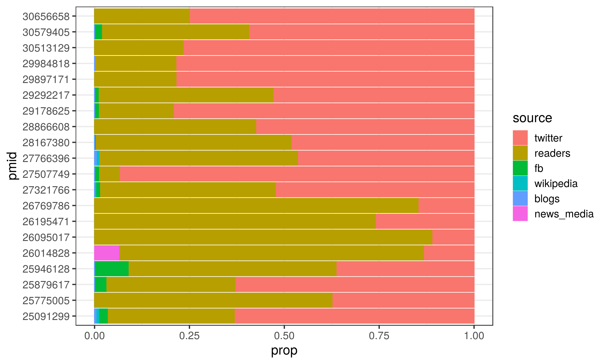

# **On-line Attention of Research Outputs**

On-line attention and engagement for research is now well recognised as important alternative metrics to traditional metrics (although there are well recognised concerns regarding potential for manipulation), and has been repeatedly found to be positively correlated with article citations.

Altmetric is one such system that tracks the attention research outputs receive online, and this package utilises the [rAltmetric](https://cran.r-project.org/web/packages/rAltmetric/README.html) package developed by the [rOpenSci](https://ropensci.org/) group to incorporate this data.

**Note**: At present this package only includes Altmetric data. PlumX is the other major source of alternative metrics, however there is no open API available for this product (it requires an authentication token) and so has not been incorporated at present.
    
```{r setup, include = FALSE}
knitr::opts_chunk$set(collapse = FALSE)
library(dplyr);library(ggplot2)

source('~/impactr/R/impact_altmetric.R')

pmid <- readRDS("~/starsurg_impact/data/data_pub.rds")$pmid
```

## **impact_altmetric()**
Altmetric is a system that tracks the attention that research outputs such as scholarly articles and datasets receive online. It pulls data from:

 - Social media like Twitter and Facebook 
 
 - Traditional media - both mainstream (The Guardian, New York Times) and field specific (New Scientist, Bird Watching).
 
 - Blogs - both major organisations (Cancer Research UK) and individual researchers. 
 
 - Online reference managers like Mendeley and CiteULike

The `impact_altmetric()` function aims to provide easy access to this source of information in useful format. At present this required articles to a pubmed identification number (pmid), however functionality to use DOI as an alternative is planned.

```{r impact_altmetric, message=FALSE, warning=FALSE}
altmetric <- impactr::impact_altmetric(pmid)
```

## **Output**
There are 4 outputs from `impact_altmetric()` as nested dataframes: `$df`, `$temporal`, `$rank`, and `$source`.

### **1. Original dataset ($df)**
This will return the original dataset with data from altmetric appended as columns. There are 4 broad groups that describes the:

 - **"alm_score_" prefix**: Overall altmetric score over time (see `$temporal` output below).
 
 - **"alm_all " / "alm_journal" prefixes**: Context of altmetric score relative to other articles (see `$rank` output below).

 - **"n_engage_" prefix**: Number of engagements with the article by source (see `$source` output below).
 
 - **"date_" prefix**: Dates that the article was published, added to altmetric, and when altmetric data was last updated.

```{r impact_df_output, echo=FALSE, include=TRUE, max_height = "200px"}

col_set1 <- which(colnames(altmetric$df) %in% c("title"))
col_set2 <- which(colnames(altmetric$df) %in% c("author_list"))
col_set3 <- which(colnames(altmetric$df) %in% c("doi", "date_update", "date_pub", "date_added"))

altmetric$df %>%
  dplyr::mutate(author_list = ifelse(author_list!="NA", paste0(substr(author_list, 1, 80), "..."), author_list),
                journal = gsub(": The British Journal of Anaesthesia", "", journal)) %>%
  
  head(5) %>% 
    magrittr::set_colnames(gsub("_", " ", names(.))) %>%
  knitr::kable(format="html") %>%
  kableExtra::column_spec(col_set1, width_min="7.5in") %>%
  kableExtra::column_spec(col_set2, width_min="3in") %>%
  kableExtra::column_spec(col_set3, width_min="1.5in") %>%
  kableExtra::kable_styling(bootstrap_options = "striped", full_width = F) %>%
  kableExtra::scroll_box(width = "1000")

```

### **2. Focussed Altmetric datasets**
The following outputs do not contain additional information beyond what is already provided in `$df`. However, these provide long format and focussed aspects of data to facilitate easier visualisation and analysis. These exclude any publications not tracked by altmetric. 

#### **2. a). altmetric score over time ($temporal)**

altmetric records the altmetric score contemporaneous, and at set intervals following publication (1 week, 1 month, 3 months, 6 months, 1 year). It also records date of publication which allows calculation of a standardised time since publication (`alm_time`). 

```{r impact_alm_temporal, echo=FALSE, include=TRUE}
altmetric$temporal %>%
  head(9) %>%
  knitr::kable(format="html") %>%
  kableExtra::kable_styling(bootstrap_options = "striped", full_width = F)
```

**Figure 1**: Plot of altmetric score over time for each paper

```{r impact_altmetric_plot1a, echo = T, results = 'hide', eval=FALSE}
altmetric$temporal %>% 
  ggplot() +
  aes(x = alm_time, y = alm_score, group = pmid, colour = pmid) +
  geom_line() + geom_point() + theme_bw()
```

```{r impact_altmetric_plot1b, echo=FALSE}
plot_alm_time <- altmetric$temporal %>% 
  ggplot() +
  aes(x = alm_time, y = alm_score, group = pmid, colour = pmid) +
  geom_line() + geom_point() + theme_bw()

ggsave(plot_alm_time, filename="~/impactr/vignettes/plot/alm_plot1.png",height=5.76, width = 9.60, units ="in")
```


#### **2 b). altmetric ranking ($rank)**

The altmetric score is not normalised, and so it is meaningless without context. As such, altmetric allows you to see the score relative to other articles (whether from all indexed by altmetric or those from the same journal at the same time). Within `$rank` these categories (alm_category) include:

 - **all**: All papers recorded by altmetric.
 
 - **journal_all**: All papers recorded by altmetric **for that journal** 
 
 - **journal_3m**: All papers recorded by altmetric **for that journal within a 3 month period** 

For each category, altmetric records the following measures:

 - The mean altmetric score (`mean`).
 
 - The number (`n`) of all papers, and the rank of the specific paper within those (`rank`). 
 
 - The proportion of papers (`prop`) that the paper outranks (`rank` / `n`).

```{r impact_alm_rank, warning=FALSE, echo=FALSE, fig.align="center"}
altmetric$rank %>%
  dplyr::mutate(journal = gsub(": The British Journal of Anaesthesia", "", journal)) %>%
  head(9) %>%
  knitr::kable(format="html") %>%
  kableExtra::kable_styling(bootstrap_options = "striped", full_width = F)
```

**Figure 2**: Plot of the percentage rank of each publication within each altmetric category.

```{r plot_alm_rank1a, echo = T, results = 'hide', eval=FALSE}
altmetric$rank %>%
  dplyr::mutate(journal = gsub(": The British Journal of Anaesthesia", "", journal),
                pmid = as.character(pmid)) %>%
  dplyr::mutate("Altmetric Ranking (%)" = round(prop*100, 1),
                "Altmetric Category" = factor(as.character(alm_category), levels=c("all", "journal_all", "journal_3m"))) %>%
  ggplot() +
  aes(x = `Altmetric Category`, y = `Altmetric Ranking (%)`) +
  geom_point() + geom_boxplot() +
  theme_bw()
```
```{r plot_alm_rank1b, warning=FALSE, echo=FALSE, fig.align="center"}
plot_alm_rank <- altmetric$rank %>%
  dplyr::mutate(journal = gsub(": The British Journal of Anaesthesia", "", journal),
                pmid = as.character(pmid)) %>%
  dplyr::mutate("Altmetric Ranking (%)" = round(prop*100, 1),
                "Altmetric Category" = factor(as.character(alm_category), levels=c("all", "journal_all", "journal_3m"))) %>%
  ggplot() +
  aes(x = `Altmetric Category`, y = `Altmetric Ranking (%)`) +
  geom_point() + geom_boxplot() +
  theme_bw()

ggsave(plot_alm_rank, filename="~/impactr/vignettes/plot/alm_plot2.png",height=5.76, width = 9.60, units ="in")

```


#### **2 c). altmetric sources ($source)**

The Altmetric score for a research output provides an indicator of the amount of attention that it has received from, and as such records both the type and amount of attention recieved. This data excludes any sources **not** recorded for any of the papers. 

```{r impact_alm_source, warning=FALSE, echo=FALSE, message=FALSE}
altmetric$source %>%
  head(12) %>%
  knitr::kable(format="html") %>%
  kableExtra::kable_styling(bootstrap_options = "striped", full_width = F)
```

**Figure 3**: Plot of the proportion of altmetric sources for each paper

```{r plot_alm_source1a, echo = T, results = 'hide', eval=FALSE}
altmetric$source %>% 
  ggplot() +
  aes(x = pmid, y = prop, colour = source, fill = source) +
  geom_col() + coord_flip()+ theme_bw()
```
```{r plot_alm_source1b, echo=FALSE}
plot_alm_source <- altmetric$source %>% 
  ggplot() +
  aes(x = pmid, y = prop, colour = source, fill = source) +
  geom_col() + coord_flip()+ theme_bw(base_size = 15)

ggsave(plot_alm_source, filename="~/impactr/vignettes/plot/alm_plot3.png",height=5.76, width = 9.60, units ="in")
```


