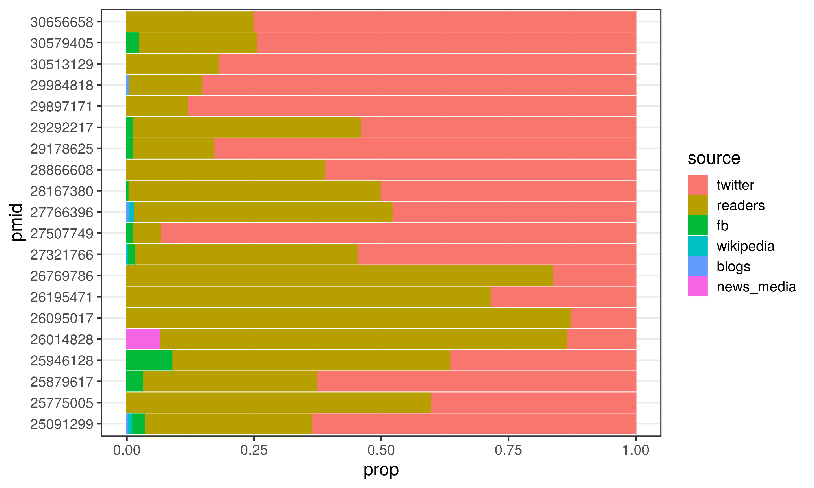

# **On-line Attention of Research Outputs**

On-line attention and engagement for research is now well recognised as important alternative metrics to traditional metrics (although there are well recognised concerns regarding potential for manipuation), and has been repeatedly found to be positively correlated with article citations.

Altmetric is one such system that tracks the attention research outputs receive online, and this package utilises the [rAltmetric](https://cran.r-project.org/web/packages/rAltmetric/README.html) package developed by the [rOpenSci](https://ropensci.org/) group to incorporate this data.

**Note**: At present this package only includes Altmetric data. PlumX is the other major source of alternative metrics, however there is no open API avialable for this product (it requires an authentication token) and so has not been incorportated at present.
    
```{r setup, include = FALSE}
knitr::opts_chunk$set(collapse = FALSE)
library(dplyr);library(ggplot2)

source('~/impactr/R/impact_almetric.R')

pmid <- readRDS("~/starsurg_impact/data/data_pub.rds")$pmid
```

## **impact_almetric()**
Altmetric is a system that tracks the attention that research outputs such as scholarly articles and datasets receive online. It pulls data from:

 - Social media like Twitter and Facebook 
 
 - Traditional media - both mainstream (The Guardian, New York Times) and field specific (New Scientist, Bird Watching).
 
 - Blogs - both major organisations (Cancer Research UK) and individual researchers. 
 
 - Online reference managers like Mendeley and CiteULike

The `impact_almetric()` function aims to provide easy access to this source of information in useful format. At present this required articles to a pubmed identfication number (pmid), however functionality to use DOI as an alternative is planned.

```{r impact_almetric, message=FALSE, warning=FALSE}
almetric <- impact_almetric(pmid)
```

## **Output**
There are 4 outputs from `impact_almetric()` as nested dataframes: `$df_output`, `$temporal`, `$rank`, and `$source`.

### **1. Original dataset ($df_output)**
This will return the original dataset with data from almetric appended as columns. There are 4 broad groups that describes the:

 - **"alm_score_" prefix**: Overall almetric score over time (see `$temporal` output below).
 
 - **"alm_all " / "alm_journal" prefixes**: Context of almetric score relative to other articles (see `$rank` output below).

 - **"n_engage_" prefix**: Number of engagements with the article by source (see `$source` output below).
 
 - **"date_" prefix**: Dates that the article was published, added to almetric, and when almetric data was last updated.

```{r impact_df_output, echo=FALSE, include=TRUE, max_height = "200px"}

col_set1 <- which(colnames(almetric$df_output) %in% c("title"))
col_set2 <- which(colnames(almetric$df_output) %in% c("author_list"))
col_set3 <- which(colnames(almetric$df_output) %in% c("doi", "date_update", "date_pub", "date_added"))

almetric$df_output %>%
  dplyr::mutate(author_list = ifelse(author_list!="NA", paste0(substr(author_list, 1, 80), "..."), author_list),
                journal = gsub(": The British Journal of Anaesthesia", "", journal)) %>%
  
  head(5) %>% 
  knitr::kable(format="html") %>%
  kableExtra::column_spec(col_set1, width_min="7.5in") %>%
  kableExtra::column_spec(col_set2, width_min="3in") %>%
  kableExtra::column_spec(col_set3, width_min="1.5in") %>%
  kableExtra::kable_styling(bootstrap_options = "striped", full_width = F) %>%
  kableExtra::scroll_box(width = "1000")

```

### **2. Focussed Altmetric datasets**
The following outputs do not contain additional information beyond what is already provided in `$df_output`. However, these provide long format and focussed aspects of data to facilitate easier visualisation and analysis. These exclude any publications not tracked by altmetric. 

#### **2. a). Almetric score over time ($temporal)**

Almetric records the almetric score contemporaneous, and at set intervals following publication (1 week, 1 month, 3 months, 6 months, 1 year). It also records date of publication which allows calculation of a standardised time since publication (`alm_time`). 

```{r impact_alm_temporal, echo=FALSE, include=TRUE}
almetric$temporal %>%
  head(9) %>%
  knitr::kable(format="html") %>%
  kableExtra::kable_styling(bootstrap_options = "striped", full_width = F)
```

**Figure 1**: Plot of almetric score over time for each paper

```{r impact_almetric_plot1a, echo=TRUE, results='hide'}
almetric$temporal %>% 
  ggplot() +
  aes(x = alm_time, y = alm_score, group = pmid, colour = pmid) +
  geom_line() + geom_point() + theme_bw()
```
```{r impact_almetric_plot1b, echo=FALSE}
plot_alm_time <- almetric$temporal %>% 
  ggplot() +
  aes(x = alm_time, y = alm_score, group = pmid, colour = pmid) +
  geom_line() + geom_point() + theme_bw()

ggsave(plot_alm_time, filename="~/impactr/vignettes/plot/alm_plot1.png",height=5.76, width = 9.60, units ="in")
```


#### **2 b). Almetric ranking ($rank)**

The almetric score is not normalised, and so it is meaningless without context. As such, almetric allows you to see the score relative to other articles (whether from all indexed by almetric or those from the same journal at the same time). Within `$rank` these categories (alm_category) include:

 - **all**: All papers recorded by almetric.
 
 - **journal_all**: All papers recorded by almetric **for that journal** 
 
 - **journal_3m**: All papers recorded by almetric **for that journal within 3 month period** 

For each category, almetric records the following measures:

 - The mean almetric score (`mean`).
 
 - The number (`n`) of all papers, and the rank of the specific paper within those (`rank`). 
 
 - The proportion of papers (`prop`) that the paper outranks (`rank` / `n`).

```{r impact_alm_rank, warning=FALSE, echo=FALSE, fig.align="center"}
almetric$rank %>%
  dplyr::mutate(journal = gsub(": The British Journal of Anaesthesia", "", journal)) %>%
  head(9) %>%
  knitr::kable(format="html") %>%
  kableExtra::kable_styling(bootstrap_options = "striped", full_width = F)
```

#### **2 c). Almetric sources ($source)**

The Altmetric score for a research output provides an indicator of the amount of attention that it has received from, and as such records both the type and amount of attention recieved. This data excludes any sources **not** recorded for any of the papers. 

```{r impact_alm_source, warning=FALSE, echo=FALSE, message=FALSE}
almetric$source %>%
  head(12) %>%
  knitr::kable(format="html") %>%
  kableExtra::kable_styling(bootstrap_options = "striped", full_width = F)
```

**Figure 2**: Plot of the proportion of almetric sources for each paper

```{r plot_alm_source1a, echo=TRUE, results='hide'}
almetric$source %>% 
  ggplot() +
  aes(x = pmid, y = prop, colour = source, fill = source) +
  geom_col() + coord_flip()+ theme_bw()
```
```{r plot_alm_source1b, echo=FALSE}
plot_alm_source <- almetric$source %>% 
  ggplot() +
  aes(x = pmid, y = prop, colour = source, fill = source) +
  geom_col() + coord_flip()+ theme_bw(base_size = 15)

ggsave(plot_alm_source, filename="~/impactr/vignettes/plot/alm_plot2.png",height=5.76, width = 9.60, units ="in")
```


