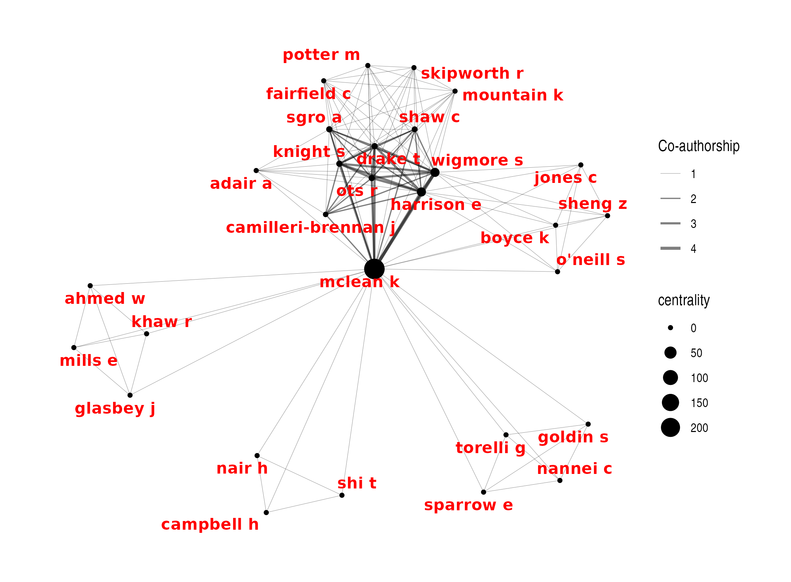
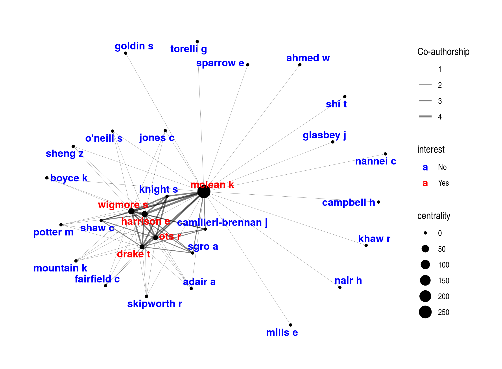
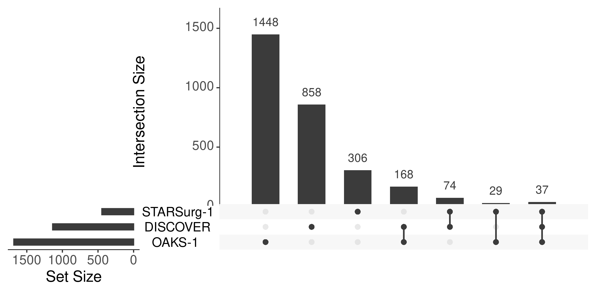
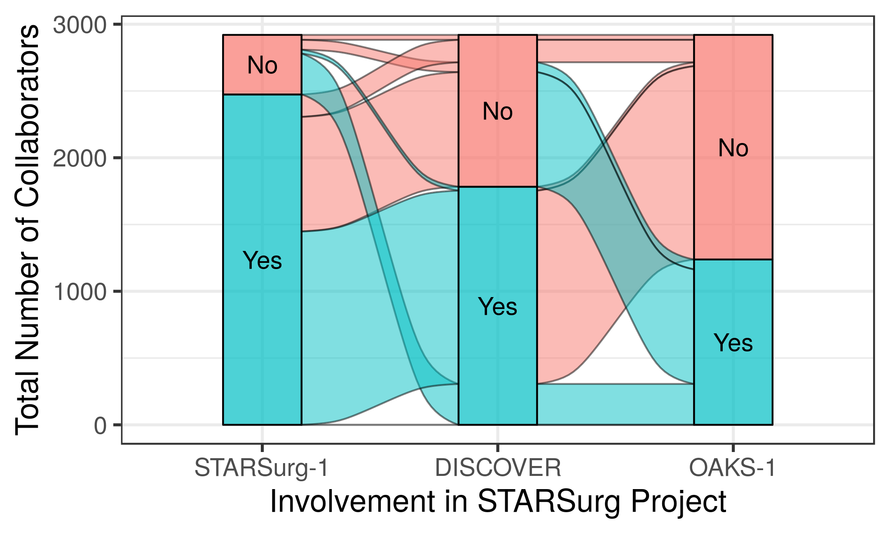

```{r setup, include = FALSE}
knitr::opts_chunk$set(collapse = FALSE)
library(tidyverse);library(magrittr); library(UpSetR);library(grid);library(ggalluvial)

```

# **Impact from from Co-authorship Network**
Authorship lists on publications can range from one to potentially hundreds or even thousands of co-authors (particularly in the case of [collaborative research](https://www.bmj.com/content/345/bmj.e5084) studies).

&nbsp;

## **impact_auth()**
The `impact_auth()` function aims to simplify this process by providing an easy method to gain a comprehensive understanding of co-authorship networks using publication data.

Both the `extract_pmid()` and `extract_doi()` functions extract a list of authors that can be used directly by `impact_auth()`. The only mandatory requirements are a dataframe of the grouping variable (`pub_group` e.g. "project") and the authors ("author").

To track co-authors across publications, the author names must be matched between the groups (and dupliciates within groups excluded). Ideally authors would be matched on ORCID (or similar unique identifier). Unfortunalely, that information is rarely stored in on-line repositories and so authors dervied in this way can only be reliably matched by last name and initials. However, `max_inital` allows flexiblity in how restrictive matching authors will be.

- If `max_inital` = 3, then the authors will be matched on their last name and exact initials (up to 3). As a result, this **more** restrictive matching may overestimate the number of unique co-authors. For example, if the **same author** is listed as "Smith ABC" and "Smith AB" on 2 separate publications, these will be treated as **different authors**.

- If `max_inital` = 1, then the authors will be matched on their last name and first initial only. As a result, this **less** restrictive matching may underestimate the number of unique co-authors. For example, if **different authors** have the same last name and first initial (e.g. listed as "Smith AB" and "Smith AK") on 2 separate publications, these will be treated as the **same author**.

&nbsp;

## **1. Traditional Authorship Model**
Traditional authorship models, largely based on the criteria of the International Committee of Medical Journal Editors (ICMJE), consider the authors' byline in the papers as the key for attributing credit. Securing a place in the byline is itself a credit, whilst taking the first place is often the reward for contributing the most to the multi-authored work. While this model has been criticised (particularly given this definition of authorship only covers a very limited series of relationships that a person can have with a published article), this remains the mainstay of scientific publication ( [read more here](https://www.ncbi.nlm.nih.gov/pmc/articles/PMC3677992/) ).

An example of several papers published using a traditional authorship model can be seen here:
```{r impact_auth_intro1a, warning=FALSE, message=FALSE}
data_auth <- extract_pmid(pmid = c(26445672, 28280919, 27531411, 28027614,30850367, 31585971, 30793373)) %>%
  
  dplyr::mutate(pmid = factor(pmid)) %>%
  dplyr::select(pmid, author_n, author_list)
```

```{r impact_auth_intro1b, warning=FALSE, message=FALSE, echo=FALSE}
data_auth %>%
  dplyr::mutate(author_list = paste0(substr(author_list, 1, 80), "...")) %>%
  knitr::kable() %>% kableExtra::kable_styling(bootstrap_options = "striped", full_width = F)
```
```{r impact_auth_intro1c, warning=FALSE, message=FALSE}
example_auth <- impact_auth(data_auth, pub_group = "pmid", max_inital = 1)
```


&nbsp;

### **a). Unique authors (`$list`)**
We can use `impact_auth()` to derive a basic summary (`$list`) of all unique collaborators across all groups (`author`), and their involvement in each (`pub_n`, `pub_group`). 

```{r impact_auth_2b, warning=FALSE, message=FALSE, eval=FALSE}
example_auth$list
```

```{r impact_auth_2c, warning=FALSE, message=FALSE, echo=FALSE}
example_auth$list %>%
  dplyr::slice(., sample(1:nrow(.),5,replace=F)) %>%
  knitr::kable() %>% kableExtra::kable_styling(bootstrap_options = "striped", full_width = F)
```

&nbsp;

### **b). Network analysis (`impact_auth_network()`)**
Scientific collaboration networks are a hallmark of contemporary academic research. Researchers are no longer independent players, but members of teams that bring together complementary skills and multidisciplinary approaches around common goals. Social network analysis and co-authorship networks are increasingly used as powerful tools to assess collaboration trends and to identify leading scientists and organizations ( [read more here](https://health-policy-systems.biomedcentral.com/articles/10.1186/s12961-016-0104-5) ). R provides many capabilities to visualise network analyses, however all require inputs with specific formats in order to perform these.

**`impact_auth_network()`** takes a dataframe produced by `extract_pmid()` or `extract_doi()` (or any dataframe which matches the format of the `pmid` or `doi`, and `auth_list` columns) and will produce a nested list of:

1. **$node**: All individual authors.

2. **$edge**: All connections between authors (and their weight).

This can then be plotted using packages such as `igraph`, `tidygraph`, `networkD3`, etc.

```{r impact_auth_network1a, warning=FALSE, message=FALSE, echo=TRUE}
plot_network1 <- impact_auth_network(data_auth, id ="pmid") %$%
  
  tidygraph::tbl_graph(nodes = node, edges = edge, directed = FALSE) %>%
  dplyr::mutate(centrality = tidygraph::centrality_betweenness()) %>% 
  
  ggraph::ggraph(layout = "nicely") +
  ggraph::geom_edge_link(aes(width = weight), alpha = 0.5) + 
  ggraph::scale_edge_width(range = c(0.1, 1)) +
  ggraph::geom_node_point(aes(size = centrality)) +
  ggraph::geom_node_text(aes(label = author),colour="red", fontface="bold", repel = TRUE) +
  ggplot2::scale_color_manual(values = c("Yes" = "red", "No" = "#ADD8E6")) +
  ggplot2::labs(edge_width = "Co-authorship") +
  ggraph::theme_graph()
```
```{r impact_auth_network1b, warning=FALSE, message=FALSE, echo=FALSE}
ggsave(plot = plot_network1,
       filename="~/impactr/vignettes/plot/plot_network1.png",height=5.6, width = 7.60, units ="in")
```    



&nbsp;

If there are specific authors of interest, these can be supplied via `auth_interest`. This will ensure only direct connections to the specified author(s) will be included.

```{r impact_auth_network2a, warning=FALSE, message=FALSE, echo=TRUE}
plot_network2 <- impact_auth_network(data_auth,
                                     auth_interest = c("mclean k", "drake t", "harrison e", "ots r", "wigmore s"),
                                     id = "pmid") %$%
  
  tidygraph::tbl_graph(nodes = node, edges = edge, directed = FALSE) %>%
  dplyr::mutate(centrality = tidygraph::centrality_betweenness()) %>% 
  
  ggraph::ggraph(layout = "nicely") +
  ggraph::geom_edge_link(aes(width = weight), alpha = 0.2) + 
  ggraph::scale_edge_width(range = c(0.1, 1)) +
  ggraph::geom_node_point(aes(size = centrality)) +
  ggraph::geom_node_text(aes(label = author, group = interest, colour = interest), fontface="bold", repel = TRUE) +
  ggplot2::scale_color_manual(values = c("Yes" = "red", "No" = "blue")) +
  ggplot2::labs(edge_width = "Co-authorship") +
  ggraph::theme_graph()
```
```{r impact_auth_network2b, warning=FALSE, message=FALSE, echo=FALSE}
ggsave(plot = plot_network2,
       filename="~/impactr/vignettes/plot/plot_network2.png",height=5.6, width = 7.60, units ="in")
```



**Note**: *Publications with a hundreds or thousands of authors (e.g. collaborative authorship model publications) are generally unsuitable for this form of network analysis. It is recommended that UpSet plots are used instead to investigate these publications (see below). However, if the publications under investigation consist of traditional and collaborative authorships, this can be done (however `edge_min` should be set to 2 or more to account for the high number of single connections within publications).*

&nbsp;

## **2. Collaborative Authorship Model**
Collaborative research is becoming increasingly common, recognising the valuable contribution that people beyond traditionally recognised "authors" make. Typically, those involved are listed as PubMed-citable "collaborators" on the publications due to contibuting eligible data. The number of "collaborators" can range from hundreds to thousands.

An example of several publications by the [STARSurg collaborative](https://starsurg.org/) using a collaborative authorship model can be seen below. This composes 3 successive studies from the group (STARSurg-1, DISCOVER, and OAKS-1)

```{r impact_collab1a, warning=FALSE, message=FALSE}
data_collab <- extract_pmid(pmid = c(25091299, 27321766, 30513129), get_auth = TRUE, get_collaborators = T) %>%
  dplyr::mutate(project = factor(pmid,
                                 levels = c(25091299, 27321766, 30513129),
                                 labels =c("STARSurg-1", "DISCOVER", "OAKS-1"))) %>%
  dplyr::select(project, pmid, collab_n, collab_list)
```

```{r impact_collab1b, warning=FALSE, message=FALSE, echo=FALSE}
data_collab %>%
  dplyr::mutate(collab_list = paste0(substr(collab_list, 1, 80), "...")) %>%
  knitr::kable() %>% kableExtra::kable_styling(bootstrap_options = "striped", full_width = F)
```

```{r impact_collab1c, warning=FALSE, message=FALSE}
example_collab <- impactr::impact_auth(data_collab, author_list = "collab_list",pub_group = "project", 
                                       max_inital = 1, upset = TRUE, metric = TRUE)
```

&nbsp;

### **a). Unique authors (`$list`)**
We can use `impact_auth()` to derive a basic summary (`$list`) of all unique collaborators across all groups (`author`), and their involvement in each (`pub_n`, `pub_group`). 

```{r impact_collab2a, warning=FALSE, message=FALSE, eval=FALSE}
example_collab$list
```

```{r impact_collab2b, warning=FALSE, message=FALSE, echo=FALSE}
example_collab$list %>%
  dplyr::slice(., sample(1:nrow(.),5,replace=F)) %>%
  knitr::kable() %>% kableExtra::kable_styling(bootstrap_options = "striped", full_width = F)
```

This data can be used in a variety of ways, including a basic summary of involvement over time. For example, the number of projects authors/collaborators have been involved in:

```{r impact_auth_ss1, warning=FALSE, message=FALSE, echo = FALSE}
example_collab$list %>%
  finalfit::summary_factorlist(explanatory = "pub_n", column = TRUE) %>%
  tibble::as_tibble() %>% knitr::kable() %>%
  kableExtra::kable_styling(bootstrap_options = "striped", full_width = F)
```

&nbsp;

### **b). Intersection analysis (`$upset`)**
As discussed above, when collaborative authorship reaches hundreds or thousands, detailed network analysis becomes meaningless. Instead, the `impact_auth()` function has the capability to derive information on how the authors relate using the `upset = TRUE` argument.

A subset of the `$upset` output is displayed below. Each column is a level from the `pub_group` variable (e.g. "project"), with `1` representing presence and the `0` representing absence of the author from each project.

```{r impact_auth_upset1b, warning=FALSE, message=FALSE, echo=FALSE}
example_collab$upset %>%
  dplyr::slice(., sample(1:nrow(.),5,replace=F)) %>%
  knitr::kable() %>% kableExtra::kable_styling(bootstrap_options = "striped", full_width = F)
```

&nbsp;

#### **i). Summary**

The `upset` output can be used to derive information on the relationships between authors and the groups (`pub_group` variable).

```{r impact_auth_upset2, warning=FALSE, message=FALSE}
upset_comb_mat <- impactr::format_intersect(example_collab$upset) %>% knitr::kable() %>%
  kableExtra::kable_styling(bootstrap_options = "striped", full_width = F)
```

&nbsp;

#### **ii). UpSet plots**

Furthermore, UpSet plots provide an efficient way to visualize intersections of multiple sets compared to the traditional approaches (e.g. Venn Diagram). The `upset` output can be used directly to make UpSet plots via the [UpSetR](https://github.com/hms-dbmi/UpSetR) packages.

```{r impact_auth_upset3bi, echo=TRUE, results='hide', eval=FALSE}
as.data.frame(example_collab$upset) %>% UpSetR::upset(text.scale = 1.7)

```

```{r impact_auth_upset3bii, echo=FALSE, message=FALSE, error=FALSE,include=FALSE, warning = FALSE}
plot_upset2 <- example_collab$upset %>% as.data.frame() %>%
  UpSetR::upset(text.scale = 1.7)

png(file="~/impactr/vignettes/plot/plot_upset2.png", height = 3.76, width = 7.60, units = "in", res=300)
plot_upset2
dev.off()
```


#### **iii). Alluvial diagrams:**
Alternatively, it can be used for Alluvial diagrams to provide a visualisation of author/collaborator involvement over time (variations of [Sankey diagrams](https://datavizcatalogue.com/methods/sankey_diagram.html)). This is only meaningful for *recurrent studies* from the *same group*. 

```{r impact_auth_alluvial, warning=FALSE, message=FALSE, echo = FALSE}
plot_alluvial <-  example_collab$upset %>%
  # format data
  mutate_all(function(x){factor(x, levels = c(0, 1), labels = c("No", "Yes"))}) %>%
  table() %>% tibble::as_tibble() %>%
  ggforce::gather_set_data(., x = 1:(which(colnames(.)=="n")-1), id="alluvium") %>%
  dplyr::mutate(project = factor(x, levels = unique(x)),
                strata = factor(y, levels = unique(y))) %>%
  
  # select only essential columns
  dplyr::select(project, strata, n, alluvium) %>%
  
  # plot data
  ggplot() +
  aes(x = project, y = n, alluvium = alluvium, stratum = strata, fill = strata, label = strata) +
  ggalluvial::geom_flow(stat = "alluvium", lode.guidance = "rightleft", aes.flow = "backward", color = "black") +
  ggalluvial::geom_stratum(alpha = 0.7) +
  geom_text(stat = "stratum", size = 5) +
  scale_x_discrete(name = "Involvement in STARSurg Project") +
  scale_y_continuous(name = "Total Number of Collaborators") +
  theme_bw(base_size = 18) + guides(fill=FALSE)

ggsave(plot_alluvial, filename = "~/impactr/vignettes/plot/plot_alluvial.png",
       height = 5.76*0.75, width = 9.60*0.75)
```



&nbsp;

### c). **Collaborative authorship metrics (`$metrics`)**
In addition to more traditional research metrics, a measure of the success of these projects is reflected in:

1. Growth: The number of new collaborators involved in each project 

2. Retention: The involvement of collaborators across multiple projects.

3. Overall engagement: The total number of collaborators involved in the project.

However, with potentially thousands of collaborators involved, being able to easily compare authors across multiple publications is a challenging task. Therefore, `impact_auth()` can provide metrics on author/collaborator engagement over time (note this requires `upset=TRUE`). This is only meaningful for *recurrent studies* from the *same group*. 

```{r impact_auth_metric1a, warning=FALSE, message=FALSE, eval=FALSE}
example_collab$metric
```

```{r impact_auth_metric1b, warning=FALSE, message=FALSE, echo=FALSE}
knitr::kable(example_collab$metric)%>% 
  kableExtra::kable_styling(bootstrap_options = "striped", full_width = F) %>% 
  kableExtra::scroll_box(width = "1000")
```

a). `total_change_prop` and `new_change_prop` refers to the number of collaborators (in total or new) involved in each project compared to the previous project.

- A value of **1** indicates **consistant** engagement **compared with previous years** (stable growth).

- A value **>1** indicates an **increase** in engagement **compared with previous years** (accelerated growth).

b). `retain_prop` refers to the proportion of collaborators from each project involved in future projects (e.g. `n_retain` / `n_total`). This value can range from 0 (0%) to 1 (100%).

&nbsp;
