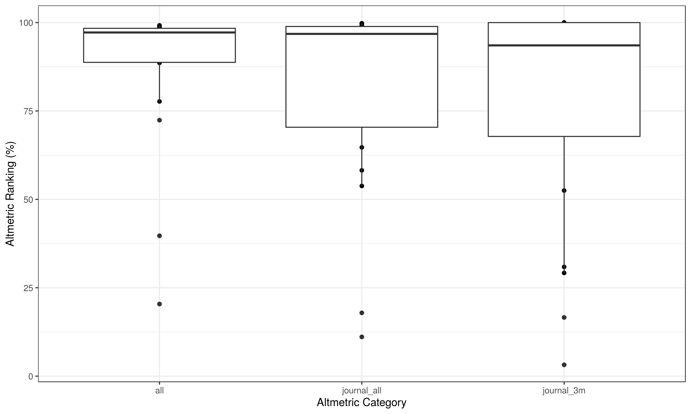

# **On-line Attention of Research Outputs**

On-line attention and engagement for research is now well recognised as important alternative metrics to traditional metrics (although there are well recognised concerns regarding potential for manipulation), and has been repeatedly found to be positively correlated with article citations.

Altmetric is one such system that tracks the attention research outputs receive online, and this package utilises the [rAltmetric](https://cran.r-project.org/web/packages/rAltmetric/README.html) package developed by the [rOpenSci](https://ropensci.org/) group to incorporate this data.

**Note**: At present this package only includes Altmetric data. PlumX is the other major source of alternative metrics, however there is no open API available for this product (it requires an authentication token) and so has not been incorporated at present.
    


## **impact_altmetric()**
Altmetric is a system that tracks the attention that research outputs such as scholarly articles and datasets receive online. It pulls data from:

 - Social media like Twitter and Facebook 
 
 - Traditional media - both mainstream (The Guardian, New York Times) and field specific (New Scientist, Bird Watching).
 
 - Blogs - both major organisations (Cancer Research UK) and individual researchers. 
 
 - Online reference managers like Mendeley and CiteULike

The `impact_altmetric()` function aims to provide easy access to this source of information in useful format. At present this required articles to a pubmed identification number (pmid), however functionality to use DOI as an alternative is planned.


```r
altmetric <- impactr::impact_altmetric(pmid)
```

## **Output**
There are 4 outputs from `impact_altmetric()` as nested dataframes: `$df`, `$temporal`, `$rank`, and `$source`.

### **1. Original dataset ($df)**
This will return the original dataset with data from altmetric appended as columns. There are 4 broad groups that describes the:

 - **"alm_score_" prefix**: Overall altmetric score over time (see `$temporal` output below).
 
 - **"alm_all " / "alm_journal" prefixes**: Context of altmetric score relative to other articles (see `$rank` output below).

 - **"n_engage_" prefix**: Number of engagements with the article by source (see `$source` output below).
 
 - **"date_" prefix**: Dates that the article was published, added to altmetric, and when altmetric data was last updated.

<div style="border: 1px solid #ddd; padding: 5px; overflow-x: scroll; width:1000; "><table class="table table-striped" style="width: auto !important; margin-left: auto; margin-right: auto;">
 <thead>
  <tr>
   <th style="text-align:right;"> n </th>
   <th style="text-align:left;"> id </th>
   <th style="text-align:left;"> id type </th>
   <th style="text-align:left;"> doi </th>
   <th style="text-align:left;"> altmetric id </th>
   <th style="text-align:left;"> title </th>
   <th style="text-align:left;"> type </th>
   <th style="text-align:left;"> author list </th>
   <th style="text-align:left;"> journal </th>
   <th style="text-align:left;"> journal issn </th>
   <th style="text-align:right;"> alm score 1w </th>
   <th style="text-align:right;"> alm score 1m </th>
   <th style="text-align:right;"> alm score 3m </th>
   <th style="text-align:right;"> alm score 6m </th>
   <th style="text-align:right;"> alm score 1y </th>
   <th style="text-align:right;"> alm score 6d </th>
   <th style="text-align:right;"> alm score 5d </th>
   <th style="text-align:right;"> alm score 4d </th>
   <th style="text-align:right;"> alm score 3d </th>
   <th style="text-align:right;"> alm score 2d </th>
   <th style="text-align:right;"> alm score 1d </th>
   <th style="text-align:right;"> alm score now </th>
   <th style="text-align:right;"> alm all mean </th>
   <th style="text-align:right;"> alm all n </th>
   <th style="text-align:right;"> alm all rank </th>
   <th style="text-align:right;"> alm all pct </th>
   <th style="text-align:right;"> alm all higher than </th>
   <th style="text-align:right;"> alm all prop </th>
   <th style="text-align:right;"> alm journal all mean </th>
   <th style="text-align:right;"> alm journal all rank </th>
   <th style="text-align:right;"> alm journal all n </th>
   <th style="text-align:right;"> alm journal all pct </th>
   <th style="text-align:right;"> alm journal all higher than </th>
   <th style="text-align:right;"> alm journal all prop </th>
   <th style="text-align:right;"> alm 3m n </th>
   <th style="text-align:right;"> alm 3m mean </th>
   <th style="text-align:right;"> alm 3m rank </th>
   <th style="text-align:right;"> alm 3m pct </th>
   <th style="text-align:right;"> alm 3m higher than </th>
   <th style="text-align:right;"> alm 3m prop </th>
   <th style="text-align:right;"> alm journal 3m mean </th>
   <th style="text-align:right;"> alm journal 3m rank </th>
   <th style="text-align:right;"> alm journal 3m n </th>
   <th style="text-align:right;"> alm journal 3m pct </th>
   <th style="text-align:right;"> alm journal 3m higher than </th>
   <th style="text-align:right;"> alm journal 3m prop </th>
   <th style="text-align:left;"> date publish </th>
   <th style="text-align:left;"> date update </th>
   <th style="text-align:left;"> date added </th>
   <th style="text-align:right;"> n engage fb </th>
   <th style="text-align:right;"> n engage blogs </th>
   <th style="text-align:right;"> n engage all </th>
   <th style="text-align:right;"> n engage twitter posts </th>
   <th style="text-align:right;"> n engage wikipedia </th>
   <th style="text-align:right;"> n engage twitter accounts </th>
   <th style="text-align:right;"> n engage news media </th>
   <th style="text-align:right;"> n engage policy source </th>
   <th style="text-align:right;"> n engage peer review sites </th>
   <th style="text-align:right;"> n engage forum </th>
   <th style="text-align:right;"> n engage googleplus </th>
   <th style="text-align:right;"> n engage research highlight </th>
   <th style="text-align:right;"> n engage linkedin </th>
   <th style="text-align:right;"> n engage readers </th>
   <th style="text-align:right;"> n engage other </th>
   <th style="text-align:left;"> url image </th>
  </tr>
 </thead>
<tbody>
  <tr>
   <td style="text-align:right;"> 1 </td>
   <td style="text-align:left;"> 30656658 </td>
   <td style="text-align:left;"> pmid </td>
   <td style="text-align:left;min-width: 1.5in; "> NA </td>
   <td style="text-align:left;"> NA </td>
   <td style="text-align:left;min-width: 7.5in; "> NA </td>
   <td style="text-align:left;"> NA </td>
   <td style="text-align:left;min-width: 3in; "> NA </td>
   <td style="text-align:left;"> NA </td>
   <td style="text-align:left;"> NA </td>
   <td style="text-align:right;"> NA </td>
   <td style="text-align:right;"> NA </td>
   <td style="text-align:right;"> NA </td>
   <td style="text-align:right;"> NA </td>
   <td style="text-align:right;"> NA </td>
   <td style="text-align:right;"> NA </td>
   <td style="text-align:right;"> NA </td>
   <td style="text-align:right;"> NA </td>
   <td style="text-align:right;"> NA </td>
   <td style="text-align:right;"> NA </td>
   <td style="text-align:right;"> NA </td>
   <td style="text-align:right;"> NA </td>
   <td style="text-align:right;"> NA </td>
   <td style="text-align:right;"> NA </td>
   <td style="text-align:right;"> NA </td>
   <td style="text-align:right;"> NA </td>
   <td style="text-align:right;"> NA </td>
   <td style="text-align:right;"> NA </td>
   <td style="text-align:right;"> NA </td>
   <td style="text-align:right;"> NA </td>
   <td style="text-align:right;"> NA </td>
   <td style="text-align:right;"> NA </td>
   <td style="text-align:right;"> NA </td>
   <td style="text-align:right;"> NA </td>
   <td style="text-align:right;"> NA </td>
   <td style="text-align:right;"> NA </td>
   <td style="text-align:right;"> NA </td>
   <td style="text-align:right;"> NA </td>
   <td style="text-align:right;"> NA </td>
   <td style="text-align:right;"> NA </td>
   <td style="text-align:right;"> NA </td>
   <td style="text-align:right;"> NA </td>
   <td style="text-align:right;"> NA </td>
   <td style="text-align:right;"> NA </td>
   <td style="text-align:right;"> NA </td>
   <td style="text-align:right;"> NA </td>
   <td style="text-align:left;"> NA </td>
   <td style="text-align:left;min-width: 1.5in; "> NA </td>
   <td style="text-align:left;min-width: 1.5in; "> NA </td>
   <td style="text-align:right;"> 0 </td>
   <td style="text-align:right;"> 0 </td>
   <td style="text-align:right;"> 0 </td>
   <td style="text-align:right;"> 0 </td>
   <td style="text-align:right;"> 0 </td>
   <td style="text-align:right;"> 0 </td>
   <td style="text-align:right;"> 0 </td>
   <td style="text-align:right;"> 0 </td>
   <td style="text-align:right;"> 0 </td>
   <td style="text-align:right;"> 0 </td>
   <td style="text-align:right;"> 0 </td>
   <td style="text-align:right;"> 0 </td>
   <td style="text-align:right;"> 0 </td>
   <td style="text-align:right;"> 0 </td>
   <td style="text-align:right;"> 0 </td>
   <td style="text-align:left;"> NA </td>
  </tr>
  <tr>
   <td style="text-align:right;"> 2 </td>
   <td style="text-align:left;"> 30579405 </td>
   <td style="text-align:left;"> pmid </td>
   <td style="text-align:left;min-width: 1.5in; "> 10.1002/bjs.9614 </td>
   <td style="text-align:left;"> 2570470 </td>
   <td style="text-align:left;min-width: 7.5in; "> Impact of postoperative non-steroidal anti-inflammatory drugs on adverse events after gastrointestinal surgery </td>
   <td style="text-align:left;"> article </td>
   <td style="text-align:left;min-width: 3in; "> NA </td>
   <td style="text-align:left;"> British Journal of Surgery </td>
   <td style="text-align:left;"> 0007-1323 </td>
   <td style="text-align:right;"> 0 </td>
   <td style="text-align:right;"> 0.5 </td>
   <td style="text-align:right;"> 0.5 </td>
   <td style="text-align:right;"> 0.5 </td>
   <td style="text-align:right;"> 7.55 </td>
   <td style="text-align:right;"> 0 </td>
   <td style="text-align:right;"> 0 </td>
   <td style="text-align:right;"> 0 </td>
   <td style="text-align:right;"> 0 </td>
   <td style="text-align:right;"> 0 </td>
   <td style="text-align:right;"> 0 </td>
   <td style="text-align:right;"> 112.408 </td>
   <td style="text-align:right;"> 9.064135 </td>
   <td style="text-align:right;"> 15958977 </td>
   <td style="text-align:right;"> 187629 </td>
   <td style="text-align:right;"> 98 </td>
   <td style="text-align:right;"> 15771434 </td>
   <td style="text-align:right;"> 0.9882431 </td>
   <td style="text-align:right;"> 12.24805 </td>
   <td style="text-align:right;"> 65 </td>
   <td style="text-align:right;"> 3956 </td>
   <td style="text-align:right;"> 98 </td>
   <td style="text-align:right;"> 3891 </td>
   <td style="text-align:right;"> 0.9838220 </td>
   <td style="text-align:right;"> 196088 </td>
   <td style="text-align:right;"> 8.832371 </td>
   <td style="text-align:right;"> 2431 </td>
   <td style="text-align:right;"> 98 </td>
   <td style="text-align:right;"> 193657 </td>
   <td style="text-align:right;"> 0.9876076 </td>
   <td style="text-align:right;"> 4.626923 </td>
   <td style="text-align:right;"> 1 </td>
   <td style="text-align:right;"> 40 </td>
   <td style="text-align:right;"> 97 </td>
   <td style="text-align:right;"> 39 </td>
   <td style="text-align:right;"> 1.0000000 </td>
   <td style="text-align:left;"> 2014-08-04 </td>
   <td style="text-align:left;min-width: 1.5in; "> 2020-09-24 </td>
   <td style="text-align:left;min-width: 1.5in; "> 2014-08-05 </td>
   <td style="text-align:right;"> 7 </td>
   <td style="text-align:right;"> 1 </td>
   <td style="text-align:right;"> 393 </td>
   <td style="text-align:right;"> 164 </td>
   <td style="text-align:right;"> 2 </td>
   <td style="text-align:right;"> 174 </td>
   <td style="text-align:right;"> 0 </td>
   <td style="text-align:right;"> 0 </td>
   <td style="text-align:right;"> 0 </td>
   <td style="text-align:right;"> 0 </td>
   <td style="text-align:right;"> 0 </td>
   <td style="text-align:right;"> 0 </td>
   <td style="text-align:right;"> 0 </td>
   <td style="text-align:right;"> 0 </td>
   <td style="text-align:right;"> 0 </td>
   <td style="text-align:left;"> https://badges.altmetric.com/?size=180&amp;score=113&amp;types=btttttwf </td>
  </tr>
  <tr>
   <td style="text-align:right;"> 3 </td>
   <td style="text-align:left;"> 30513129 </td>
   <td style="text-align:left;"> pmid </td>
   <td style="text-align:left;min-width: 1.5in; "> NA </td>
   <td style="text-align:left;"> NA </td>
   <td style="text-align:left;min-width: 7.5in; "> NA </td>
   <td style="text-align:left;"> NA </td>
   <td style="text-align:left;min-width: 3in; "> NA </td>
   <td style="text-align:left;"> NA </td>
   <td style="text-align:left;"> NA </td>
   <td style="text-align:right;"> NA </td>
   <td style="text-align:right;"> NA </td>
   <td style="text-align:right;"> NA </td>
   <td style="text-align:right;"> NA </td>
   <td style="text-align:right;"> NA </td>
   <td style="text-align:right;"> NA </td>
   <td style="text-align:right;"> NA </td>
   <td style="text-align:right;"> NA </td>
   <td style="text-align:right;"> NA </td>
   <td style="text-align:right;"> NA </td>
   <td style="text-align:right;"> NA </td>
   <td style="text-align:right;"> NA </td>
   <td style="text-align:right;"> NA </td>
   <td style="text-align:right;"> NA </td>
   <td style="text-align:right;"> NA </td>
   <td style="text-align:right;"> NA </td>
   <td style="text-align:right;"> NA </td>
   <td style="text-align:right;"> NA </td>
   <td style="text-align:right;"> NA </td>
   <td style="text-align:right;"> NA </td>
   <td style="text-align:right;"> NA </td>
   <td style="text-align:right;"> NA </td>
   <td style="text-align:right;"> NA </td>
   <td style="text-align:right;"> NA </td>
   <td style="text-align:right;"> NA </td>
   <td style="text-align:right;"> NA </td>
   <td style="text-align:right;"> NA </td>
   <td style="text-align:right;"> NA </td>
   <td style="text-align:right;"> NA </td>
   <td style="text-align:right;"> NA </td>
   <td style="text-align:right;"> NA </td>
   <td style="text-align:right;"> NA </td>
   <td style="text-align:right;"> NA </td>
   <td style="text-align:right;"> NA </td>
   <td style="text-align:right;"> NA </td>
   <td style="text-align:right;"> NA </td>
   <td style="text-align:left;"> NA </td>
   <td style="text-align:left;min-width: 1.5in; "> NA </td>
   <td style="text-align:left;min-width: 1.5in; "> NA </td>
   <td style="text-align:right;"> 0 </td>
   <td style="text-align:right;"> 0 </td>
   <td style="text-align:right;"> 0 </td>
   <td style="text-align:right;"> 0 </td>
   <td style="text-align:right;"> 0 </td>
   <td style="text-align:right;"> 0 </td>
   <td style="text-align:right;"> 0 </td>
   <td style="text-align:right;"> 0 </td>
   <td style="text-align:right;"> 0 </td>
   <td style="text-align:right;"> 0 </td>
   <td style="text-align:right;"> 0 </td>
   <td style="text-align:right;"> 0 </td>
   <td style="text-align:right;"> 0 </td>
   <td style="text-align:right;"> 0 </td>
   <td style="text-align:right;"> 0 </td>
   <td style="text-align:left;"> NA </td>
  </tr>
  <tr>
   <td style="text-align:right;"> 4 </td>
   <td style="text-align:left;"> 29984818 </td>
   <td style="text-align:left;"> pmid </td>
   <td style="text-align:left;min-width: 1.5in; "> 10.1371/journal.pone.0118899 </td>
   <td style="text-align:left;"> 3798277 </td>
   <td style="text-align:left;min-width: 7.5in; "> Social Media and Internet Driven Study Recruitment: Evaluating a New Model for Promoting Collaborator Engagement and Participation </td>
   <td style="text-align:left;"> article </td>
   <td style="text-align:left;min-width: 3in; "> Chetan Khatri, Stephen J. Chapman, James Glasbey, Michael Kelly, Dmitri Nepogodi... </td>
   <td style="text-align:left;"> PLoS ONE </td>
   <td style="text-align:left;"> 1932-6203 </td>
   <td style="text-align:right;"> 0 </td>
   <td style="text-align:right;"> 0.0 </td>
   <td style="text-align:right;"> 0.0 </td>
   <td style="text-align:right;"> 2.0 </td>
   <td style="text-align:right;"> 2.00 </td>
   <td style="text-align:right;"> 0 </td>
   <td style="text-align:right;"> 0 </td>
   <td style="text-align:right;"> 0 </td>
   <td style="text-align:right;"> 0 </td>
   <td style="text-align:right;"> 0 </td>
   <td style="text-align:right;"> 0 </td>
   <td style="text-align:right;"> 41.400 </td>
   <td style="text-align:right;"> 9.007694 </td>
   <td style="text-align:right;"> 15815117 </td>
   <td style="text-align:right;"> 530862 </td>
   <td style="text-align:right;"> 96 </td>
   <td style="text-align:right;"> 15284074 </td>
   <td style="text-align:right;"> 0.9664333 </td>
   <td style="text-align:right;"> 12.97886 </td>
   <td style="text-align:right;"> 8598 </td>
   <td style="text-align:right;"> 156808 </td>
   <td style="text-align:right;"> 94 </td>
   <td style="text-align:right;"> 148206 </td>
   <td style="text-align:right;"> 0.9451750 </td>
   <td style="text-align:right;"> 262834 </td>
   <td style="text-align:right;"> 10.062533 </td>
   <td style="text-align:right;"> 11472 </td>
   <td style="text-align:right;"> 95 </td>
   <td style="text-align:right;"> 251357 </td>
   <td style="text-align:right;"> 0.9563565 </td>
   <td style="text-align:right;"> 13.110770 </td>
   <td style="text-align:right;"> 246 </td>
   <td style="text-align:right;"> 4398 </td>
   <td style="text-align:right;"> 94 </td>
   <td style="text-align:right;"> 4152 </td>
   <td style="text-align:right;"> 0.9442929 </td>
   <td style="text-align:left;"> 2015-03-16 </td>
   <td style="text-align:left;min-width: 1.5in; "> 2020-06-11 </td>
   <td style="text-align:left;min-width: 1.5in; "> 2015-03-17 </td>
   <td style="text-align:right;"> 0 </td>
   <td style="text-align:right;"> 0 </td>
   <td style="text-align:right;"> 143 </td>
   <td style="text-align:right;"> 72 </td>
   <td style="text-align:right;"> 0 </td>
   <td style="text-align:right;"> 72 </td>
   <td style="text-align:right;"> 0 </td>
   <td style="text-align:right;"> 0 </td>
   <td style="text-align:right;"> 0 </td>
   <td style="text-align:right;"> 0 </td>
   <td style="text-align:right;"> 0 </td>
   <td style="text-align:right;"> 0 </td>
   <td style="text-align:right;"> 0 </td>
   <td style="text-align:right;"> 0 </td>
   <td style="text-align:right;"> 0 </td>
   <td style="text-align:left;"> https://badges.altmetric.com/?size=180&amp;score=42&amp;types=tttttttt </td>
  </tr>
  <tr>
   <td style="text-align:right;"> 5 </td>
   <td style="text-align:left;"> 29897171 </td>
   <td style="text-align:left;"> pmid </td>
   <td style="text-align:left;min-width: 1.5in; "> 10.1186/s12909-015-0326-1 </td>
   <td style="text-align:left;"> 3784521 </td>
   <td style="text-align:left;min-width: 7.5in; "> Promoting research and audit at medical school: evaluating the educational impact of participation in a student-led national collaborative study </td>
   <td style="text-align:left;"> article </td>
   <td style="text-align:left;min-width: 3in; "> Stephen J Chapman, James C D Glasbey, Chetan Khatri, Michael Kelly, Dmitri Nepog... </td>
   <td style="text-align:left;"> BMC Medical Education </td>
   <td style="text-align:left;"> 1472-6920 </td>
   <td style="text-align:right;"> 0 </td>
   <td style="text-align:right;"> 0.0 </td>
   <td style="text-align:right;"> 0.0 </td>
   <td style="text-align:right;"> 0.0 </td>
   <td style="text-align:right;"> 2.50 </td>
   <td style="text-align:right;"> 0 </td>
   <td style="text-align:right;"> 0 </td>
   <td style="text-align:right;"> 0 </td>
   <td style="text-align:right;"> 0 </td>
   <td style="text-align:right;"> 0 </td>
   <td style="text-align:right;"> 0 </td>
   <td style="text-align:right;"> 54.050 </td>
   <td style="text-align:right;"> 9.048781 </td>
   <td style="text-align:right;"> 15922255 </td>
   <td style="text-align:right;"> 417371 </td>
   <td style="text-align:right;"> 97 </td>
   <td style="text-align:right;"> 15504714 </td>
   <td style="text-align:right;"> 0.9737870 </td>
   <td style="text-align:right;"> 6.43047 </td>
   <td style="text-align:right;"> 26 </td>
   <td style="text-align:right;"> 2252 </td>
   <td style="text-align:right;"> 98 </td>
   <td style="text-align:right;"> 2226 </td>
   <td style="text-align:right;"> 0.9888988 </td>
   <td style="text-align:right;"> 219704 </td>
   <td style="text-align:right;"> 10.141062 </td>
   <td style="text-align:right;"> 7499 </td>
   <td style="text-align:right;"> 96 </td>
   <td style="text-align:right;"> 212203 </td>
   <td style="text-align:right;"> 0.9658723 </td>
   <td style="text-align:right;"> 0.000000 </td>
   <td style="text-align:right;"> 1 </td>
   <td style="text-align:right;"> 1 </td>
   <td style="text-align:right;"> 1 </td>
   <td style="text-align:right;"> 0 </td>
   <td style="text-align:right;"> 1.0000000 </td>
   <td style="text-align:left;"> 2015-03-13 </td>
   <td style="text-align:left;min-width: 1.5in; "> 2020-02-02 </td>
   <td style="text-align:left;min-width: 1.5in; "> 2015-03-13 </td>
   <td style="text-align:right;"> 5 </td>
   <td style="text-align:right;"> 0 </td>
   <td style="text-align:right;"> 194 </td>
   <td style="text-align:right;"> 91 </td>
   <td style="text-align:right;"> 0 </td>
   <td style="text-align:right;"> 96 </td>
   <td style="text-align:right;"> 0 </td>
   <td style="text-align:right;"> 0 </td>
   <td style="text-align:right;"> 0 </td>
   <td style="text-align:right;"> 0 </td>
   <td style="text-align:right;"> 0 </td>
   <td style="text-align:right;"> 0 </td>
   <td style="text-align:right;"> 0 </td>
   <td style="text-align:right;"> 0 </td>
   <td style="text-align:right;"> 0 </td>
   <td style="text-align:left;"> https://badges.altmetric.com/?size=180&amp;score=55&amp;types=tttttfff </td>
  </tr>
</tbody>
</table></div>

### **2. Focussed Altmetric datasets**
The following outputs do not contain additional information beyond what is already provided in `$df`. However, these provide long format and focussed aspects of data to facilitate easier visualisation and analysis. These exclude any publications not tracked by altmetric. 

#### **2. a). altmetric score over time ($temporal)**

altmetric records the altmetric score contemporaneous, and at set intervals following publication (1 week, 1 month, 3 months, 6 months, 1 year). It also records date of publication which allows calculation of a standardised time since publication (`alm_time`). 

<table class="table table-striped" style="width: auto !important; margin-left: auto; margin-right: auto;">
 <thead>
  <tr>
   <th style="text-align:left;"> id </th>
   <th style="text-align:left;"> doi </th>
   <th style="text-align:left;"> date_update </th>
   <th style="text-align:left;"> date_added </th>
   <th style="text-align:right;"> alm_time </th>
   <th style="text-align:right;"> alm_score </th>
  </tr>
 </thead>
<tbody>
  <tr>
   <td style="text-align:left;"> 29292217 </td>
   <td style="text-align:left;"> 10.1001/jamasurg.2015.0806 </td>
   <td style="text-align:left;"> 2015-07-28 </td>
   <td style="text-align:left;"> 2015-05-09 </td>
   <td style="text-align:right;"> 0 </td>
   <td style="text-align:right;"> 0 </td>
  </tr>
  <tr>
   <td style="text-align:left;"> 29292217 </td>
   <td style="text-align:left;"> 10.1001/jamasurg.2015.0806 </td>
   <td style="text-align:left;"> 2015-07-28 </td>
   <td style="text-align:left;"> 2015-05-09 </td>
   <td style="text-align:right;"> 1 </td>
   <td style="text-align:right;"> 0 </td>
  </tr>
  <tr>
   <td style="text-align:left;"> 29292217 </td>
   <td style="text-align:left;"> 10.1001/jamasurg.2015.0806 </td>
   <td style="text-align:left;"> 2015-07-28 </td>
   <td style="text-align:left;"> 2015-05-09 </td>
   <td style="text-align:right;"> 2 </td>
   <td style="text-align:right;"> 0 </td>
  </tr>
  <tr>
   <td style="text-align:left;"> 29292217 </td>
   <td style="text-align:left;"> 10.1001/jamasurg.2015.0806 </td>
   <td style="text-align:left;"> 2015-07-28 </td>
   <td style="text-align:left;"> 2015-05-09 </td>
   <td style="text-align:right;"> 3 </td>
   <td style="text-align:right;"> 0 </td>
  </tr>
  <tr>
   <td style="text-align:left;"> 29292217 </td>
   <td style="text-align:left;"> 10.1001/jamasurg.2015.0806 </td>
   <td style="text-align:left;"> 2015-07-28 </td>
   <td style="text-align:left;"> 2015-05-09 </td>
   <td style="text-align:right;"> 4 </td>
   <td style="text-align:right;"> 0 </td>
  </tr>
  <tr>
   <td style="text-align:left;"> 29292217 </td>
   <td style="text-align:left;"> 10.1001/jamasurg.2015.0806 </td>
   <td style="text-align:left;"> 2015-07-28 </td>
   <td style="text-align:left;"> 2015-05-09 </td>
   <td style="text-align:right;"> 5 </td>
   <td style="text-align:right;"> 0 </td>
  </tr>
  <tr>
   <td style="text-align:left;"> 29292217 </td>
   <td style="text-align:left;"> 10.1001/jamasurg.2015.0806 </td>
   <td style="text-align:left;"> 2015-07-28 </td>
   <td style="text-align:left;"> 2015-05-09 </td>
   <td style="text-align:right;"> 6 </td>
   <td style="text-align:right;"> 0 </td>
  </tr>
  <tr>
   <td style="text-align:left;"> 29292217 </td>
   <td style="text-align:left;"> 10.1001/jamasurg.2015.0806 </td>
   <td style="text-align:left;"> 2015-07-28 </td>
   <td style="text-align:left;"> 2015-05-09 </td>
   <td style="text-align:right;"> 7 </td>
   <td style="text-align:right;"> 0 </td>
  </tr>
  <tr>
   <td style="text-align:left;"> 29292217 </td>
   <td style="text-align:left;"> 10.1001/jamasurg.2015.0806 </td>
   <td style="text-align:left;"> 2015-07-28 </td>
   <td style="text-align:left;"> 2015-05-09 </td>
   <td style="text-align:right;"> 30 </td>
   <td style="text-align:right;"> 0 </td>
  </tr>
</tbody>
</table>

**Figure 1**: Plot of altmetric score over time for each paper


```r
altmetric$temporal %>% 
  ggplot() +
  aes(x = alm_time, y = alm_score, group = pmid, colour = pmid) +
  geom_line() + geom_point() + theme_bw()
```


```
## Error: Aesthetics must be either length 1 or the same as the data (247): group and colour
```


#### **2 b). altmetric ranking ($rank)**

The altmetric score is not normalised, and so it is meaningless without context. As such, altmetric allows you to see the score relative to other articles (whether from all indexed by altmetric or those from the same journal at the same time). Within `$rank` these categories (alm_category) include:

 - **all**: All papers recorded by altmetric.
 
 - **journal_all**: All papers recorded by altmetric **for that journal** 
 
 - **journal_3m**: All papers recorded by altmetric **for that journal within a 3 month period** 

For each category, altmetric records the following measures:

 - The mean altmetric score (`mean`).
 
 - The number (`n`) of all papers, and the rank of the specific paper within those (`rank`). 
 
 - The proportion of papers (`prop`) that the paper outranks (`rank` / `n`).

<table class="table table-striped" style="width: auto !important; margin-left: auto; margin-right: auto;">
 <thead>
  <tr>
   <th style="text-align:left;"> id </th>
   <th style="text-align:left;"> doi </th>
   <th style="text-align:left;"> journal </th>
   <th style="text-align:right;"> alm_score </th>
   <th style="text-align:left;"> comparator_journal </th>
   <th style="text-align:left;"> comparator_time </th>
   <th style="text-align:right;"> mean </th>
   <th style="text-align:right;"> n </th>
   <th style="text-align:right;"> rank </th>
   <th style="text-align:right;"> prop </th>
  </tr>
 </thead>
<tbody>
  <tr>
   <td style="text-align:left;"> 30579405 </td>
   <td style="text-align:left;"> 10.1002/bjs.9614 </td>
   <td style="text-align:left;"> British Journal of Surgery </td>
   <td style="text-align:right;"> 112.408 </td>
   <td style="text-align:left;"> all </td>
   <td style="text-align:left;"> ever </td>
   <td style="text-align:right;"> 9.064135 </td>
   <td style="text-align:right;"> 15958977 </td>
   <td style="text-align:right;"> 187629 </td>
   <td style="text-align:right;"> 0.9882431 </td>
  </tr>
  <tr>
   <td style="text-align:left;"> 30579405 </td>
   <td style="text-align:left;"> 10.1002/bjs.9614 </td>
   <td style="text-align:left;"> British Journal of Surgery </td>
   <td style="text-align:right;"> 112.408 </td>
   <td style="text-align:left;"> British Journal of Surgery </td>
   <td style="text-align:left;"> ever </td>
   <td style="text-align:right;"> 12.248053 </td>
   <td style="text-align:right;"> 3956 </td>
   <td style="text-align:right;"> 65 </td>
   <td style="text-align:right;"> 0.9838220 </td>
  </tr>
  <tr>
   <td style="text-align:left;"> 30579405 </td>
   <td style="text-align:left;"> 10.1002/bjs.9614 </td>
   <td style="text-align:left;"> British Journal of Surgery </td>
   <td style="text-align:right;"> 112.408 </td>
   <td style="text-align:left;"> all </td>
   <td style="text-align:left;"> 3 months </td>
   <td style="text-align:right;"> 8.832371 </td>
   <td style="text-align:right;"> 196088 </td>
   <td style="text-align:right;"> 2431 </td>
   <td style="text-align:right;"> 0.9876076 </td>
  </tr>
  <tr>
   <td style="text-align:left;"> 30579405 </td>
   <td style="text-align:left;"> 10.1002/bjs.9614 </td>
   <td style="text-align:left;"> British Journal of Surgery </td>
   <td style="text-align:right;"> 112.408 </td>
   <td style="text-align:left;"> British Journal of Surgery </td>
   <td style="text-align:left;"> 3 months </td>
   <td style="text-align:right;"> 4.626923 </td>
   <td style="text-align:right;"> 40 </td>
   <td style="text-align:right;"> 1 </td>
   <td style="text-align:right;"> 1.0000000 </td>
  </tr>
  <tr>
   <td style="text-align:left;"> 29984818 </td>
   <td style="text-align:left;"> 10.1371/journal.pone.0118899 </td>
   <td style="text-align:left;"> PLoS ONE </td>
   <td style="text-align:right;"> 41.400 </td>
   <td style="text-align:left;"> all </td>
   <td style="text-align:left;"> ever </td>
   <td style="text-align:right;"> 9.007694 </td>
   <td style="text-align:right;"> 15815117 </td>
   <td style="text-align:right;"> 530862 </td>
   <td style="text-align:right;"> 0.9664333 </td>
  </tr>
  <tr>
   <td style="text-align:left;"> 29984818 </td>
   <td style="text-align:left;"> 10.1371/journal.pone.0118899 </td>
   <td style="text-align:left;"> PLoS ONE </td>
   <td style="text-align:right;"> 41.400 </td>
   <td style="text-align:left;"> PLoS ONE </td>
   <td style="text-align:left;"> ever </td>
   <td style="text-align:right;"> 12.978864 </td>
   <td style="text-align:right;"> 156808 </td>
   <td style="text-align:right;"> 8598 </td>
   <td style="text-align:right;"> 0.9451750 </td>
  </tr>
  <tr>
   <td style="text-align:left;"> 29984818 </td>
   <td style="text-align:left;"> 10.1371/journal.pone.0118899 </td>
   <td style="text-align:left;"> PLoS ONE </td>
   <td style="text-align:right;"> 41.400 </td>
   <td style="text-align:left;"> all </td>
   <td style="text-align:left;"> 3 months </td>
   <td style="text-align:right;"> 10.062533 </td>
   <td style="text-align:right;"> 262834 </td>
   <td style="text-align:right;"> 11472 </td>
   <td style="text-align:right;"> 0.9563565 </td>
  </tr>
  <tr>
   <td style="text-align:left;"> 29984818 </td>
   <td style="text-align:left;"> 10.1371/journal.pone.0118899 </td>
   <td style="text-align:left;"> PLoS ONE </td>
   <td style="text-align:right;"> 41.400 </td>
   <td style="text-align:left;"> PLoS ONE </td>
   <td style="text-align:left;"> 3 months </td>
   <td style="text-align:right;"> 13.110770 </td>
   <td style="text-align:right;"> 4398 </td>
   <td style="text-align:right;"> 246 </td>
   <td style="text-align:right;"> 0.9442929 </td>
  </tr>
  <tr>
   <td style="text-align:left;"> 29897171 </td>
   <td style="text-align:left;"> 10.1186/s12909-015-0326-1 </td>
   <td style="text-align:left;"> BMC Medical Education </td>
   <td style="text-align:right;"> 54.050 </td>
   <td style="text-align:left;"> all </td>
   <td style="text-align:left;"> ever </td>
   <td style="text-align:right;"> 9.048781 </td>
   <td style="text-align:right;"> 15922255 </td>
   <td style="text-align:right;"> 417371 </td>
   <td style="text-align:right;"> 0.9737870 </td>
  </tr>
</tbody>
</table>

**Figure 2**: Plot of the percentage rank of each publication within each altmetric category.


```r
altmetric$rank %>%
  dplyr::mutate(journal = gsub(": The British Journal of Anaesthesia", "", journal),
                pmid = as.character(pmid)) %>%
  dplyr::mutate("Altmetric Ranking (%)" = round(prop*100, 1),
                "Altmetric Category" = factor(as.character(alm_category), levels=c("all", "journal_all", "journal_3m"))) %>%
  ggplot() +
  aes(x = `Altmetric Category`, y = `Altmetric Ranking (%)`) +
  geom_point() + geom_boxplot() +
  theme_bw()
```

```
## Error: Invalid index: out of bounds
```

```
## Error in grid.draw(plot): object 'plot_alm_rank' not found
```




#### **2 c). altmetric sources ($source)**

The Altmetric score for a research output provides an indicator of the amount of attention that it has received from, and as such records both the type and amount of attention recieved. This data excludes any sources **not** recorded for any of the papers. 

<table class="table table-striped" style="width: auto !important; margin-left: auto; margin-right: auto;">
 <thead>
  <tr>
   <th style="text-align:left;"> id </th>
   <th style="text-align:left;"> doi </th>
   <th style="text-align:right;"> n_engage_all </th>
   <th style="text-align:left;"> source </th>
   <th style="text-align:right;"> n </th>
   <th style="text-align:right;"> total </th>
   <th style="text-align:right;"> prop </th>
  </tr>
 </thead>
<tbody>
  <tr>
   <td style="text-align:left;"> 30579405 </td>
   <td style="text-align:left;"> 10.1002/bjs.9614 </td>
   <td style="text-align:right;"> 393 </td>
   <td style="text-align:left;"> fb </td>
   <td style="text-align:right;"> 7 </td>
   <td style="text-align:right;"> 174 </td>
   <td style="text-align:right;"> 0.0402299 </td>
  </tr>
  <tr>
   <td style="text-align:left;"> 30579405 </td>
   <td style="text-align:left;"> 10.1002/bjs.9614 </td>
   <td style="text-align:right;"> 393 </td>
   <td style="text-align:left;"> blogs </td>
   <td style="text-align:right;"> 1 </td>
   <td style="text-align:right;"> 174 </td>
   <td style="text-align:right;"> 0.0057471 </td>
  </tr>
  <tr>
   <td style="text-align:left;"> 30579405 </td>
   <td style="text-align:left;"> 10.1002/bjs.9614 </td>
   <td style="text-align:right;"> 393 </td>
   <td style="text-align:left;"> twitter </td>
   <td style="text-align:right;"> 164 </td>
   <td style="text-align:right;"> 174 </td>
   <td style="text-align:right;"> 0.9425287 </td>
  </tr>
  <tr>
   <td style="text-align:left;"> 30579405 </td>
   <td style="text-align:left;"> 10.1002/bjs.9614 </td>
   <td style="text-align:right;"> 393 </td>
   <td style="text-align:left;"> wikipedia </td>
   <td style="text-align:right;"> 2 </td>
   <td style="text-align:right;"> 174 </td>
   <td style="text-align:right;"> 0.0114943 </td>
  </tr>
  <tr>
   <td style="text-align:left;"> 30579405 </td>
   <td style="text-align:left;"> 10.1002/bjs.9614 </td>
   <td style="text-align:right;"> 393 </td>
   <td style="text-align:left;"> news_media </td>
   <td style="text-align:right;"> 0 </td>
   <td style="text-align:right;"> 174 </td>
   <td style="text-align:right;"> 0.0000000 </td>
  </tr>
  <tr>
   <td style="text-align:left;"> 29984818 </td>
   <td style="text-align:left;"> 10.1371/journal.pone.0118899 </td>
   <td style="text-align:right;"> 143 </td>
   <td style="text-align:left;"> fb </td>
   <td style="text-align:right;"> 0 </td>
   <td style="text-align:right;"> 72 </td>
   <td style="text-align:right;"> 0.0000000 </td>
  </tr>
  <tr>
   <td style="text-align:left;"> 29984818 </td>
   <td style="text-align:left;"> 10.1371/journal.pone.0118899 </td>
   <td style="text-align:right;"> 143 </td>
   <td style="text-align:left;"> blogs </td>
   <td style="text-align:right;"> 0 </td>
   <td style="text-align:right;"> 72 </td>
   <td style="text-align:right;"> 0.0000000 </td>
  </tr>
  <tr>
   <td style="text-align:left;"> 29984818 </td>
   <td style="text-align:left;"> 10.1371/journal.pone.0118899 </td>
   <td style="text-align:right;"> 143 </td>
   <td style="text-align:left;"> twitter </td>
   <td style="text-align:right;"> 72 </td>
   <td style="text-align:right;"> 72 </td>
   <td style="text-align:right;"> 1.0000000 </td>
  </tr>
  <tr>
   <td style="text-align:left;"> 29984818 </td>
   <td style="text-align:left;"> 10.1371/journal.pone.0118899 </td>
   <td style="text-align:right;"> 143 </td>
   <td style="text-align:left;"> wikipedia </td>
   <td style="text-align:right;"> 0 </td>
   <td style="text-align:right;"> 72 </td>
   <td style="text-align:right;"> 0.0000000 </td>
  </tr>
  <tr>
   <td style="text-align:left;"> 29984818 </td>
   <td style="text-align:left;"> 10.1371/journal.pone.0118899 </td>
   <td style="text-align:right;"> 143 </td>
   <td style="text-align:left;"> news_media </td>
   <td style="text-align:right;"> 0 </td>
   <td style="text-align:right;"> 72 </td>
   <td style="text-align:right;"> 0.0000000 </td>
  </tr>
  <tr>
   <td style="text-align:left;"> 29897171 </td>
   <td style="text-align:left;"> 10.1186/s12909-015-0326-1 </td>
   <td style="text-align:right;"> 194 </td>
   <td style="text-align:left;"> fb </td>
   <td style="text-align:right;"> 5 </td>
   <td style="text-align:right;"> 96 </td>
   <td style="text-align:right;"> 0.0520833 </td>
  </tr>
  <tr>
   <td style="text-align:left;"> 29897171 </td>
   <td style="text-align:left;"> 10.1186/s12909-015-0326-1 </td>
   <td style="text-align:right;"> 194 </td>
   <td style="text-align:left;"> blogs </td>
   <td style="text-align:right;"> 0 </td>
   <td style="text-align:right;"> 96 </td>
   <td style="text-align:right;"> 0.0000000 </td>
  </tr>
</tbody>
</table>

**Figure 3**: Plot of the proportion of altmetric sources for each paper


```r
altmetric$source %>% 
  ggplot() +
  aes(x = pmid, y = prop, colour = source, fill = source) +
  geom_col() + coord_flip()+ theme_bw()
```

```
## Error: Aesthetics must be either length 1 or the same as the data (100): x
```


